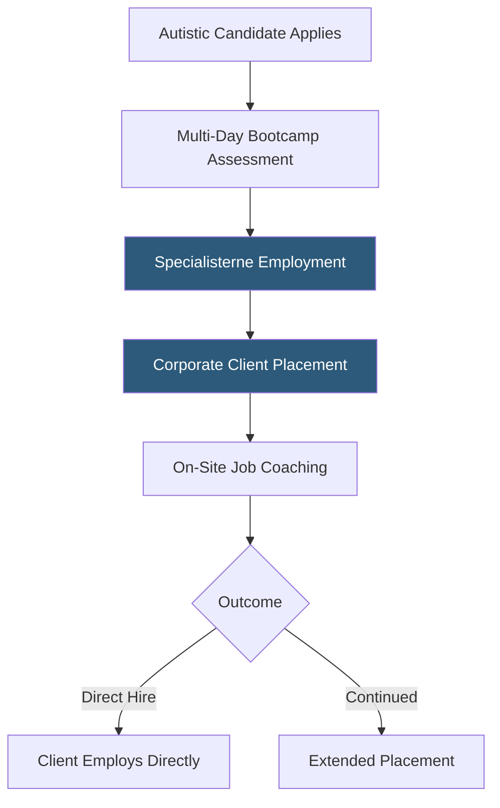

**Category:** Diversity & Inclusion Recruiting
**Difficulty:** Intermediate
**Reading time:** 6 min read

---

Specialisterne is a global social enterprise that recruits, trains, and places autistic adults in corporate employment, particularly in technology and analytical roles. It operates a staffing and consulting model where autistic workers are employed as consultants placed with client companies.

- **Social enterprise** — a business model with a social mission (autism employment) supported by commercial revenue
- **Consultant placement model** — Specialisterne employs autistic workers directly and places them as consultants with client companies
- **Bootcamp assessment** — multi-day intensive evaluation of candidates through real work tasks rather than interviews
- **Corporate partnership** — employer relationship where companies receive consulting services and talent while meeting DEI commitments
- **LEAN process skills** — systematic, process-oriented work competencies where many autistic workers excel
- **Transition support** — structured pathway from assessment through full-time placement with ongoing coaching

Specialisterne's model is structurally different from job boards or matching platforms. Rather than connecting candidates with employers, Specialisterne acts as an intermediary employer: it recruits autistic candidates, assesses them through bootcamp-style evaluations, hires them as Specialisterne employees, and then places them as consultants with corporate client partners.

The bootcamp assessment eliminates traditional interviews entirely. Over 3–5 days, candidates complete real work tasks — software testing, data analysis, process mapping, IT support tasks — that mirror the actual work they would be doing. Assessment is done by Specialisterne specialists trained in observing autistic workers' performance, not by HR generalists looking for social fit signals.

Corporate clients pay Specialisterne a consulting fee for the placed workers. This arrangement reduces the client's direct employment risk while providing access to a population of highly capable workers with skills particularly suited to quality-demanding technical roles. Major clients have included companies like SAP, Microsoft, and various financial institutions.

Placed consultants receive ongoing job coaching — both on-site and remotely — helping them navigate workplace social dynamics, communicate accommodation needs, and manage performance expectations. After a defined period, high-performing consultants are often offered direct employment by the client company.

- A bank running a software testing function that requires precision and pattern recognition
- An autistic professional who has been repeatedly screened out of roles despite passing technical tests
- A technology company wanting to build an autism employment program with expert support
- An enterprise QA team needing a large cohort of detail-oriented testers
- A government agency meeting disability employment targets with meaningful role integration

| Advantage | Disadvantage |
|-----------|--------------|
| Consulting model reduces perceived client hiring risk | Premium pricing compared to direct sourcing |
| Bootcamp assessment is more accurate than interview-based hiring | Geographic availability limited to regions with Specialisterne offices |
| Ongoing job coaching dramatically improves retention | Transition to direct employment is not guaranteed |
| Social enterprise mission aligns with corporate ESG commitments | Model complexity more involved than standard hiring |

- [Hire Autism Neurodiverse Talent](hire-autism-neurodiverse-talent.md)
- [AutismAbility Neurodiverse Hiring](autismability-neurodiverse-hiring.md)
- [Getting Hired Disability Jobs](getting-hired-disability-jobs.md)

---
*Part of the [Diversity & Inclusion Recruiting](index.md) category · [Back to Master Index](../../index.md)*
