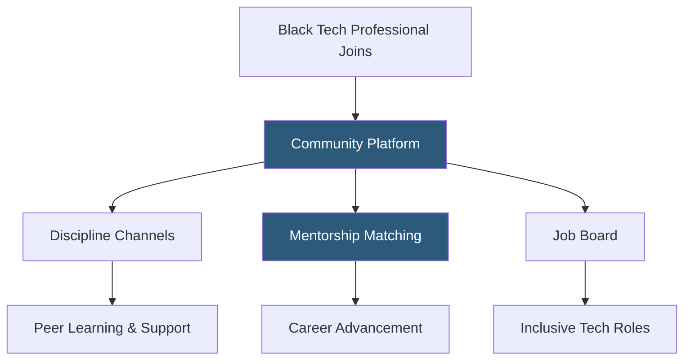

**Category:** Diversity & Inclusion Recruiting
**Difficulty:** Beginner
**Reading time:** 5 min read

---

Tech While Black is a community platform and career resource hub for Black technologists, providing networking, mentorship, job opportunities, and resources specifically addressing the experience of being Black in the technology industry.

- **Black technologist community** — network of Black professionals in software engineering, product, design, data, and other tech disciplines
- **Mentorship circles** — small group mentorship cohorts pairing Black tech professionals with experienced leaders
- **Tech-specific DEI** — focus on inclusion challenges specific to the technology industry's culture and hiring practices
- **Job board** — curated listings from technology employers with demonstrated Black inclusion practices
- **Community slack/forum** — asynchronous peer discussion channels organized by technology discipline and career stage
- **Sponsorship visibility** — connecting Black technologists with sponsors who advocate for their advancement within companies

Tech While Black addresses the specific experience of Black professionals in an industry with historically poor representation. The platform is organized around discipline-specific communities — Black engineers, Black product managers, Black designers, Black data scientists — allowing members to connect with peers who face the same technical work environments and share relevant career insights.

The community channels function as an always-on peer support network. Members discuss technical topics, share job leads, process workplace experiences involving race, and seek advice on career decisions. This informal knowledge sharing is particularly valuable for Black technologists who may be the only Black person on their team and lack peer context for navigating their specific work environment.

Mentorship matching in Tech While Black is tech-specific: mentors and mentees are matched based on technical discipline, company type (startup versus enterprise), and specific development goals. A Black junior iOS developer at a startup would be matched with a senior Black iOS engineer who has navigated the startup career track rather than a generalist mentor.

The job board features listings from technology companies that have demonstrated Black inclusion commitments through metrics like Black representation at senior technical levels, retention rates, and compensation equity data.

- A Black software engineer at a predominantly white startup seeking peer support from others in similar environments
- A Black product manager looking for a mentor who has made the IC-to-manager transition at a tech company
- A tech company recruiting Black engineers through a community platform where candidates trust the employer vetting
- A Black data scientist networking with peers in the same discipline for job referrals and technical collaboration
- A Black engineering leader building a sponsorship practice after being sponsored themselves through Tech While Black

| Advantage | Disadvantage |
|-----------|--------------|
| Tech-specific focus provides highly relevant peer community context | Limited to technology industry roles |
| Discipline organization enables technical peer-to-peer value exchange | Smaller network than general Black professional organizations |
| Community trust produces high-quality candidate engagement | Platform growth requires sustained community management investment |
| Addresses "only Black person on the team" isolation effectively | Corporate employer integration less developed than established organizations |

- [Black Career Network](black-career-network.md)
- [Blavity Career Opportunities](blavity-career-opportunities.md)
- [Women Who Code Job Board](women-who-code-job-board.md)

---
*Part of the [Diversity & Inclusion Recruiting](index.md) category · [Back to Master Index](../../index.md)*
