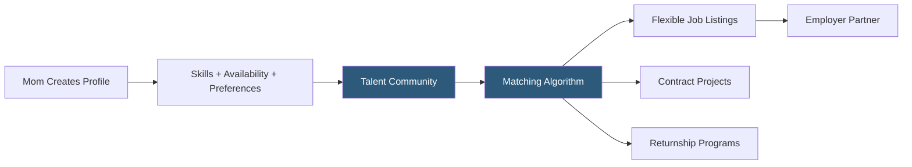

**Category:** Diversity & Inclusion Recruiting
**Difficulty:** Beginner
**Reading time:** 5 min read

---

The Mom Project is a talent marketplace connecting professional mothers with companies offering flexible, family-friendly employment. It addresses the "maternal wall" career barrier by matching experienced women with roles that accommodate parenting responsibilities through flexible schedules, remote work, and project-based engagements.

- **Maternal wall** — bias that causes employers to assume mothers are less committed or capable, limiting career advancement
- **Flexible work arrangement** — job structures including part-time, remote, compressed schedules, or contract work
- **Project-based engagement** — short-term consulting or contract roles allowing mothers to work without permanent-role commitments
- **Family-friendly employer** — company self-identifying as accommodating to caregiving responsibilities
- **Returnship** — structured re-entry program for women returning after a career break due to caregiving
- **Talent community segmentation** — grouping candidates by availability, skill level, and work arrangement preference

The Mom Project operates as a curated talent marketplace. Candidates — primarily professional mothers, but open to all caregivers — create profiles detailing their work history, skills, availability, and preferred work arrangements. Crucially, profiles let candidates specify hours per week available, preferred schedule, and willingness for remote versus on-site work.

Employer partners access the platform to post roles and source candidates. The Mom Project vets employers before listing them, requiring evidence of family-friendly policies such as flexible scheduling, parental leave, childcare benefits, or formal returnship programs. This vetting builds trust with candidates who have been burned by employers claiming flexibility but delivering rigid expectations in practice.

The platform's matching engine prioritizes alignment between a candidate's availability and the role's scheduling requirements. Employers can post full-time, part-time, contract, and project-based roles. Project postings are particularly popular with employers who want experienced professional help without the overhead of a permanent hire.

The Mom Project also provides employer-facing DEI content, return-to-work program templates, and manager training resources to help companies build sustainable inclusive practices beyond the initial hire.

- A marketing VP returning after two years of full-time parenting seeking a 30-hour-per-week role
- A startup needing a senior data analyst for a 6-month project without a full-time hire
- A mother with school-age children seeking a remote role with school-hour flexibility
- An HR team launching a formal returnship program and needing a sourcing channel
- A consulting firm building a bench of experienced freelancers with family-aware scheduling

| Advantage | Disadvantage |
|-----------|--------------|
| Pre-vetted family-friendly employers reduce misleading postings | Limited to employers who have adopted formal flex policies |
| Contract and project roles provide income flexibility | Full-time seekers may find fewer listings than general boards |
| Returnship programs address career gap stigma directly | Geographic concentration in US market |
| Skills-first matching reduces age and motherhood bias | Community size smaller than mainstream platforms |

- [The Mom Project Returnships](the-mom-project-returnships.md)
- [PowerToFly Remote Women](powertofly-remote-women.md)
- [Fairygodboss Women Workplace](fairygodboss-women-workplace.md)

---
*Part of the [Diversity & Inclusion Recruiting](index.md) category · [Back to Master Index](../../index.md)*
