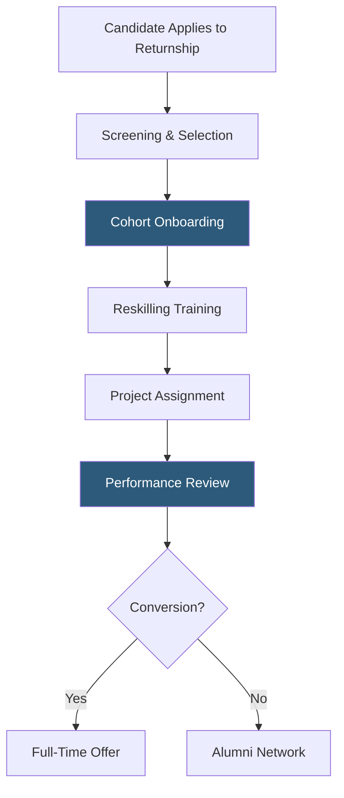

**Category:** Diversity & Inclusion Recruiting
**Difficulty:** Intermediate
**Reading time:** 6 min read

---

Returnships are structured re-entry programs that help professionals — disproportionately women — rebuild careers after extended caregiving-related breaks. The Mom Project specializes in connecting returning professionals with employers who offer formal returnship pathways with mentoring, reskilling, and pathway-to-hire structures.

- **Career gap** — a period away from employment, often due to childcare, elder care, or other caregiving duties
- **Returnship cohort** — a group of returning professionals onboarded together as a class with shared programming
- **Reskilling component** — structured training to refresh skills in rapidly evolving areas like software tools or methodologies
- **Pathway to hire** — a returnship designed with explicit conversion criteria to a permanent role
- **Sponsorship model** — pairing returnees with senior internal advocates who champion their advancement
- **Career re-entry bias** — employer tendency to discount experience preceding a career gap during evaluation

A returnship is a hybrid between an internship and a regular hire. Returning professionals — typically with 5–15 years of prior experience and a 1–5 year career gap — apply to structured programs typically lasting 12–26 weeks. Unlike internships, returnships are designed for experienced professionals and pay market-rate salaries.

The Mom Project facilitates returnship programs by connecting employers who want to establish these programs with a pool of high-quality returning candidates. The platform provides program design templates, candidate sourcing, and cohort management tools. Employers can run returnship cohorts across functions — engineering, finance, marketing, legal, operations — with candidates sourced specifically for each functional track.

Program structure typically includes an onboarding week covering company culture and current tooling, followed by embedded team placement for the bulk of the program. Participants work on real projects, receive 1:1 mentoring from senior colleagues, and attend peer cohort sessions. A formal review at the program's midpoint and end assesses performance against conversion criteria.

The Mom Project's platform tracks cohort completion rates, conversion-to-hire rates, and 12-month retention data for returned hires — metrics employers use to evaluate program ROI and refine their returnship design.

- A former software engineer returning after 3 years of childcare leave seeking structured reskilling in cloud technologies
- A financial firm wanting to build a pipeline of experienced talent without relying solely on new graduates
- An HR leader designing a company's first formal returnship program
- A marketing manager with a 2-year gap finding a bridge role back to full-time employment
- An engineering team lead who wants an experienced mid-level engineer without competing for new grad talent

| Advantage | Disadvantage |
|-----------|--------------|
| Taps highly experienced talent others overlook | Program design and mentoring requires internal investment |
| Reduces bias against career gaps with structured evaluation | 12–26 week timeline delays full productivity |
| Pathway-to-hire structure reduces hiring uncertainty | Not all returnees convert — program cost without guaranteed hire |
| Cohort model builds peer support networks for returnees | Requires dedicated internal program managers to run well |

- [The Mom Project Flexible Work](the-mom-project-flexible-work.md)
- [PowerToFly Remote Women](powertofly-remote-women.md)
- [Fairygodboss Women Workplace](fairygodboss-women-workplace.md)

---
*Part of the [Diversity & Inclusion Recruiting](index.md) category · [Back to Master Index](../../index.md)*
