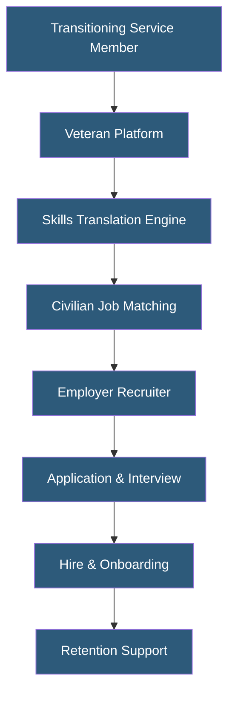

**Category:** Diversity & Inclusion Recruiting
**Difficulty:** Beginner
**Reading time:** 5 min read

---

Veteran job platforms are specialized recruiting services that connect transitioning military service members and veterans with civilian employers. They translate military experience into civilian career language and provide employers with access to a talent pool known for leadership, discipline, and specialized technical skills.

- **MOS (Military Occupational Specialty)** — Military job classifications that must be translated to civilian equivalents for recruiter understanding
- **Transition Assistance Program (TAP)** — Government programs helping service members prepare for civilian employment
- **Security Clearance** — Government-issued authorization to access classified information, a highly valued credential in defense, government, and technology sectors
- **Skills Translation** — The process of converting military experience descriptions into civilian job qualifications
- **OFCCP Compliance** — Federal Office of Federal Contract Compliance Programs requirements for veteran hiring among government contractors
- **Veteran Preference** — Legal hiring preferences for veterans in federal government positions

Veteran job platforms solve a fundamental translation problem: military service members have extensive experience but express it in military terminology that civilian recruiters may not understand. Platforms like HireVeterans.com, G.I. Jobs, and Military.com Careers use MOS-to-civilian skills mapping databases to convert military job codes into civilian role equivalents, making veteran profiles searchable by standard skills keywords.

For employers, these platforms serve a dual function. Government contractors use them to meet OFCCP veteran hiring and affirmative action plan (AAP) requirements, maintaining documentation of good-faith outreach to veteran populations. Non-contractor private employers use them to access candidates with characteristics they value — security clearances, technical certifications, leadership experience, and demonstrated performance under pressure.

Platform matching algorithms weigh security clearance level, technical specialty, leadership grade, and geographic preference when surfacing candidates. Some platforms integrate with VA Vocational Rehabilitation programs, providing access to veterans with service-related disabilities who receive employment support.

Post-hire retention tools — including veteran employee resource group directories, manager training guides, and civilian transition coaching — help reduce the high first-year attrition rates sometimes seen when veterans find civilian culture adjustment difficult.

- Defense contractors recruiting cleared professionals for government contracts
- Technology companies sourcing veterans with IT and cybersecurity backgrounds
- Financial services firms hiring disciplined, mission-focused analysts
- Law enforcement and emergency management agencies recruiting veterans
- Federal agencies meeting veteran preference hiring requirements

| Advantage | Disadvantage |
|-----------|--------------|
| Access to candidates with security clearances saves months of processing | Skills translation quality varies by platform sophistication |
| OFCCP documentation helps government contractors maintain compliance | Veterans may require longer civilian transition support |
| Leadership skills transfer across many management roles | Some veterans may not self-identify on general platforms |
| Large pool: 200,000+ service members transition annually | Geographic concentration near military bases may limit flexibility |

- [Hire Heroes USA Veterans](hire-heroes-usa-veterans.md)
- [RecruitMilitary Veteran Jobs](recruitmilitary-veteran-jobs.md)
- [Native American Job Platforms](native-american-job-platforms.md)

---
*Part of the [Diversity & Inclusion Recruiting](index.md) category · [Back to Master Index](../../index.md)*
