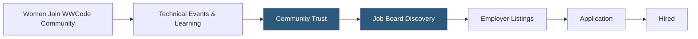

**Category:** Diversity & Inclusion Recruiting
**Difficulty:** Beginner
**Reading time:** 5 min read

---

Women Who Code (WWCode) is a global nonprofit that supports women in technology careers through events, networking, and a dedicated job board connecting female technologists with employers committed to gender diversity in engineering and technical roles.

- **Technical community** — network of women in software engineering, data science, DevOps, and related fields
- **Nonprofit job board** — employer listings funded through sponsorships rather than job seeker fees
- **DEI-committed employer** — companies that have demonstrated gender diversity commitments through programs or public reporting
- **Technical track** — community specializations covering specific technologies (Python, React, cloud, ML, etc.)
- **Event-to-hire pipeline** — pathway from community events (hackathons, conferences) to job opportunities
- **Global chapters** — WWCode local networks operating in 100+ cities providing geographic reach

Women Who Code operates a community-first model where the job board is one component of a broader ecosystem. Women join WWCode for the free technical events, study groups, and networking — the job board benefits from this trust and community engagement.

Employers access the job board by purchasing sponsor packages, which fund WWCode's nonprofit mission while providing access to the community. Sponsored roles appear prominently in the job feed and are shared with relevant technical tracks (e.g., a backend Python role is promoted in the Python network). Basic listings are available at lower cost tiers.

The job board focuses exclusively on technical and tech-adjacent roles — software engineering, data science, product management, UX/UI, DevOps, cybersecurity. This specialization makes it a targeted channel for technical recruiting rather than a general-purpose board.

WWCode's global chapter network means employers can reach candidates in specific regions. A company opening a London engineering office can target the WWCode London chapter specifically, or post globally for remote roles. The chapter events infrastructure also provides opportunities for companies to sponsor meetups and hackathons as a top-of-funnel recruiting activity.

- A tech company recruiting female software engineers through community-trusted channels
- A data team lead posting a senior ML engineer role to a technically engaged audience
- A startup sponsoring a WWCode hackathon to identify and recruit participants
- A cybersecurity firm building a pipeline of female security engineers
- A cloud provider running a virtual hiring event through WWCode's global network

| Advantage | Disadvantage |
|-----------|--------------|
| Community trust increases candidate engagement quality | Smaller volume than commercial job boards |
| Technical focus ensures relevant candidate pool | Limited to technical and tech-adjacent roles |
| Global chapter network enables geographic targeting | Community primarily US/Europe concentrated |
| Nonprofit status adds mission alignment for candidates | Sponsor packages can be cost-prohibitive for small teams |

- [PowerToFly Women in Tech](powertofly-women-in-tech.md)
- [Elpha Professional Women](elpha-professional-women.md)
- [Fairygodboss Job Board](fairygodboss-job-board.md)

---
*Part of the [Diversity & Inclusion Recruiting](index.md) category · [Back to Master Index](../../index.md)*
