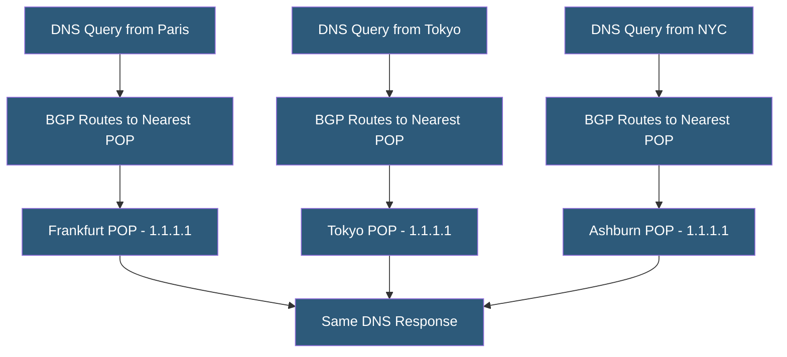

**Category:** DNS Infrastructure
**Difficulty:** Advanced
**Reading time:** 7 min read

---

Anycast DNS distributes authoritative nameserver capacity across geographically distributed nodes that share the same IP address, routing clients to the nearest instance via BGP routing. It is the architectural foundation for every large-scale DNS provider, providing low latency, DDoS resilience, and operational redundancy simultaneously.

- **Anycast** — A network addressing technique where multiple nodes share the same IP address; BGP routing delivers packets to the topologically nearest instance
- **BGP (Border Gateway Protocol)** — The internet routing protocol used to advertise anycast prefixes from multiple geographic locations
- **POP (Point of Presence)** — A geographic location hosting anycast DNS nodes connected to multiple upstream networks
- **Route Withdrawal** — Removing a BGP prefix advertisement to stop routing traffic to a node, used during maintenance or failure
- **Catch-All Anycast** — A single anycast IP serving all queries globally vs. regional anycast pools serving geographic traffic segments
- **k-root Instance** — Example of anycast root server deployment where a single root letter has 100+ instances worldwide

Anycast DNS assigns the same IP address to multiple DNS nodes in different geographic locations. Each node advertises a BGP route for the anycast prefix to its upstream transit providers. BGP's shortest-path selection causes each resolver's queries to be routed to the geographically/topologically nearest anycast node. From the client's perspective, there is a single DNS server IP; from the network's perspective, traffic is distributed across many servers worldwide.

Each anycast POP needs connectivity to multiple upstream BGP peers (transit providers, IXPs) to maximize routing coverage. A Frankfurt POP might peer with Deutsche Telekom, Telia, and DE-CIX to ensure European traffic reaches it efficiently. For global coverage, a DNS provider operates POPs at major internet exchanges: Equinix IX points in Amsterdam, Frankfurt, Chicago, Los Angeles, Singapore, and Hong Kong provide coverage for the largest traffic concentrations.

Zone data consistency is the critical operational requirement. All anycast nodes must serve identical zone data, requiring a distributed database or fast replication protocol. Cloudflare uses its own distributed key-value store; NS1 uses multi-region database replication; Route 53 uses a custom distributed state machine. Staleness between nodes must be minimized — a node serving a zone update that another node hasn't received yet creates resolver-dependent inconsistency.

Node failures are handled by BGP route withdrawal. When a node becomes unhealthy (high CPU, zone data staleness, connectivity loss), health checks trigger route withdrawal, removing the node from BGP routing within 30-90 seconds. Traffic seamlessly shifts to the next-nearest anycast node. This self-healing property makes anycast inherently fault-tolerant.

- Operating a global authoritative DNS service serving millions of domains
- Providing low-latency public recursive DNS (1.1.1.1, 8.8.8.8 model)
- Deploying root DNS server instances to minimize global resolution latency
- Building DDoS-resilient DNS infrastructure by distributing attack surface
- Delivering enterprise managed DNS with global coverage and local latency

| Advantage | Disadvantage |
|-----------|--------------|
| Sub-millisecond DNS latency for most global users | Requires BGP infrastructure and internet exchange connectivity |
| Automatic failover via BGP route withdrawal | TCP sessions (zone transfers, DoT) may break on anycast topology changes |
| Inherent DDoS mitigation by distributing attack traffic | Zone data consistency across nodes requires sophisticated replication |
| No single point of failure in the DNS serving layer | High operational expertise required to manage BGP routing correctly |

- [DNS DDoS Mitigation](dns-ddos-mitigation.md)
- [DNS Infrastructure Redundancy](dns-infrastructure-redundancy.md)
- [DNS Performance Optimization](dns-performance-optimization.md)

---
*Part of the [DNS Infrastructure](index.md) category · [Back to Master Index](../../index.md)*
