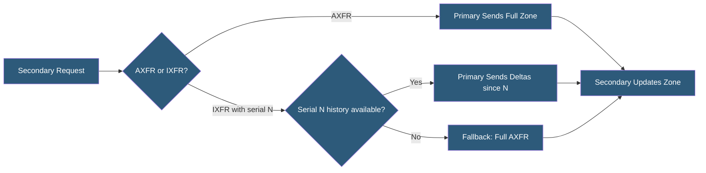

**Category:** DNS Infrastructure
**Difficulty:** Advanced
**Reading time:** 6 min read

---

AXFR (Authoritative Zone Transfer) and IXFR (Incremental Zone Transfer) are DNS protocols for replicating zone data between nameservers. AXFR transfers the complete zone; IXFR transfers only records changed since a specified serial number. Both use TCP port 53 and are defined in RFC 5936 and RFC 1995 respectively.

- **AXFR (RFC 5936)** — Full zone transfer protocol; transfers all records in a zone from primary to secondary nameserver
- **IXFR (RFC 1995)** — Incremental zone transfer; transfers only additions and deletions since the secondary last synchronized
- **Zone Serial** — The SOA serial number used as a synchronization cursor; IXFR requests specify this to retrieve subsequent changes
- **TCP Requirement** — Zone transfers use TCP (not UDP) due to response sizes exceeding UDP datagram limits
- **XFR Timeout** — A configurable limit on zone transfer duration; large zones may require extended timeouts
- **IXFR Fallback to AXFR** — When the primary does not have IXFR history for the requested serial, it returns a full AXFR response

An AXFR transfer begins when the secondary sends a DNS query with QTYPE=AXFR to the primary over a TCP connection. The primary responds with the SOA record, then all resource records in the zone, then the SOA record again as a terminator. The secondary replaces its entire zone data with the received records. For large zones with millions of records, AXFR transfers can take minutes and generate significant network traffic.

IXFR (RFC 1995) addresses efficiency by carrying only the delta between zone versions. The secondary sends an IXFR query including the SOA record with its current serial number. The primary responds with a sequence of (removed SOA, removed records, new SOA, new records) tuples representing each zone change since the specified serial. The secondary applies these deltas to produce the current zone state.

The primary must maintain change history for IXFR to be possible. BIND stores IXFR history in journal files (.jnl) alongside the zone file. The journal is compacted periodically; once compacted beyond a secondary's last serial, the primary falls back to AXFR. Operators must size journal retention appropriately for the expected secondary sync interval.

Zone transfer security uses TSIG keys (RFC 2845) — HMAC-SHA256 or HMAC-SHA512 signatures over the transfer messages. Both primary and secondary must share the same key name and secret. ACLs in the primary configuration (allow-transfer) restrict which IP addresses may initiate transfers regardless of TSIG.

- Replicating small zones between primary and secondary servers using AXFR
- Efficiently synchronizing large, frequently updated zones using IXFR
- Migrating zone data to a new DNS provider via AXFR export/import
- Implementing hidden primary architecture with public secondaries receiving AXFR
- Zone backup and audit via periodic AXFR to a monitoring system

| Advantage | Disadvantage |
|-----------|--------------|
| IXFR dramatically reduces bandwidth for active zones | IXFR requires journal maintenance on primary; adds disk overhead |
| AXFR provides a complete, self-consistent snapshot of zone data | AXFR exposes complete zone contents to any authorized recipient |
| Standard protocols work across all RFC-compliant implementations | IXFR history is lost if primary journal is compacted past secondary serial |
| TCP transport handles arbitrarily large zone files | Large AXFR transfers can timeout on low-bandwidth links |

- [DNS Zone Transfers](dns-zone-transfers.md)
- [DNS Zone Files](dns-zone-files.md)
- [Split-Horizon DNS](split-horizon-dns.md)

---
*Part of the [DNS Infrastructure](index.md) category · [Back to Master Index](../../index.md)*
