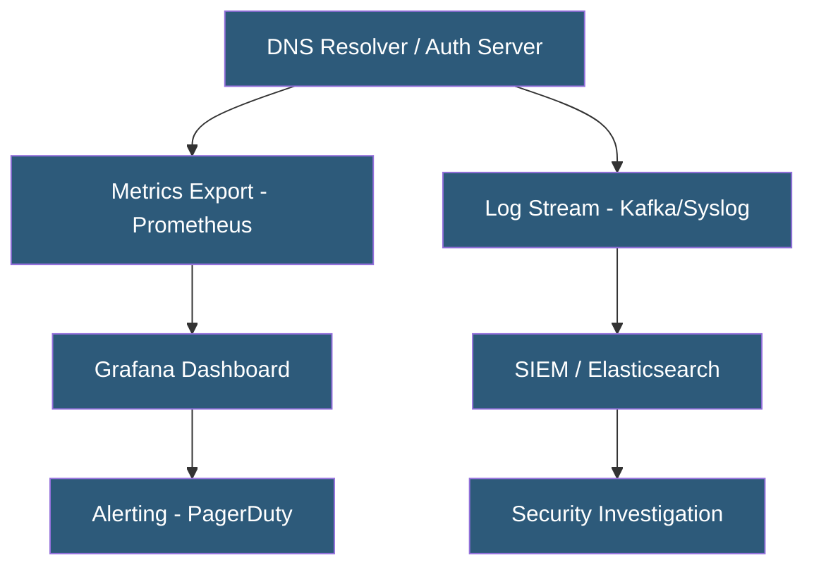

**Category:** DNS Infrastructure
**Difficulty:** Intermediate
**Reading time:** 6 min read

---

DNS analytics transforms raw query logs into actionable intelligence about traffic patterns, performance bottlenecks, security threats, and user behavior. Modern DNS providers offer built-in analytics dashboards while enterprise deployments use specialized tools to analyze billions of daily DNS events.

- **Query Volume Trending** — Time-series analysis of DNS query rates to identify traffic spikes, growth patterns, and anomalies
- **Top N Analysis** — Ranking queried domains, client IPs, or record types by volume to identify the most active elements in the DNS infrastructure
- **Response Code Distribution** — Breaking down NOERROR vs NXDOMAIN vs SERVFAIL rates to assess zone health and detect problems
- **Latency Percentiles** — P50/P95/P99 resolution times that reveal tail latency affecting user experience
- **DNS Telemetry** — Structured metrics exported from DNS servers to monitoring platforms like Prometheus, Grafana, or Datadog
- **Threat Intelligence Enrichment** — Correlating DNS query logs against threat feeds to identify malicious domain lookups

DNS analytics operates across two data streams: real-time metrics (query rates, cache hit rates, resolver latency) exported to monitoring systems, and batch log analysis for trend identification and security investigation.

Managed DNS providers like Cloudflare, NS1, and Route 53 include analytics dashboards showing query volume by record, geographic distribution of queries, response code breakdowns, and latency metrics. These dashboards update in near-real-time and support filtering by time range, record name, and record type.

Self-hosted analytics pipelines use DNS server exporters — dnsdist exports Prometheus metrics; BIND exports statistics via XML or JSON endpoints; Unbound has built-in Prometheus support. These metrics feed Grafana dashboards tracking resolver performance: queries per second, cache hit ratio, NXDOMAIN rate, and resolver latency distribution.

For security analytics, DNS log streams are consumed by SIEM platforms. Machine learning models identify anomalies: sudden spikes in NXDOMAIN queries indicating DGA malware, domains newly registered within the past 24 hours (newly observed domains or NODs) receiving queries from internal hosts, high-entropy domain names suggesting DNS tunneling, and unusual query patterns from specific client IPs.

Geographic analytics help optimize GeoDNS routing by revealing where query traffic originates, allowing operators to ensure edge nodes are positioned for actual user populations rather than assumed ones.

- Monitoring DNS infrastructure health with latency alerting
- Detecting security threats from DNS query patterns
- Capacity planning based on query volume trends
- Optimizing GeoDNS configuration using actual query origin data
- SLA reporting for managed DNS service providers

| Advantage | Disadvantage |
|-----------|--------------|
| Query pattern analytics reveal security threats invisible to other tools | Processing billions of daily DNS events requires significant infrastructure |
| Real-time metrics enable proactive capacity management | Privacy implications of DNS behavioral analytics require policy governance |
| Geographic data optimizes CDN and GeoDNS configuration | Anomaly detection requires baseline calibration to reduce false positives |
| Top N analysis quickly surfaces unusual DNS behavior | Commercial analytics dashboards add cost to managed DNS services |

- [DNS Query Logging](dns-query-logging.md)
- [GeoDNS Routing](geodns-routing.md)
- [DNS Performance Optimization](dns-performance-optimization.md)

---
*Part of the [DNS Infrastructure](index.md) category · [Back to Master Index](../../index.md)*
