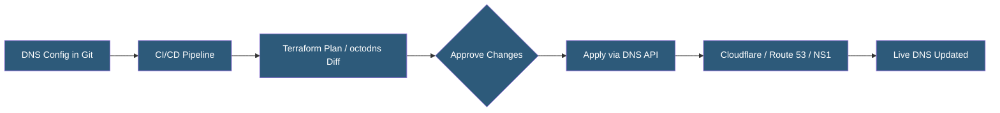

**Category:** DNS Infrastructure
**Difficulty:** Intermediate
**Reading time:** 6 min read

---

DNS automation uses APIs, infrastructure-as-code tools, and CI/CD pipelines to manage DNS records programmatically, eliminating manual zone file editing and reducing human error. Modern DNS providers offer REST APIs and Terraform providers that integrate DNS changes into automated deployment workflows.

- **DNS API** — A REST or GraphQL interface exposed by DNS providers for programmatic CRUD operations on DNS records
- **Infrastructure as Code (IaC)** — Managing DNS configuration in version-controlled code using tools like Terraform, Pulumi, or Ansible
- **CI/CD DNS Integration** — Automatically creating or updating DNS records as part of application deployment pipelines
- **Record Drift** — Inconsistency between declared (code) and actual (provider) DNS state caused by manual out-of-band changes
- **Terraform DNS Provider** — The hashicorp/dns and cloudflare/cloudflare Terraform providers for managing DNS records declaratively
- **octodns** — An open-source DNS-as-code tool supporting multi-provider zone synchronization from YAML source files

DNS providers expose REST APIs allowing CRUD operations on zones and records. Cloudflare, AWS Route 53, NS1, Cloudflare, and GCP Cloud DNS all provide comprehensive APIs with authentication via API tokens or IAM roles. Programmatic record management via these APIs enables DNS changes to be included in deployment automation.

Terraform DNS providers implement the resource/data model for DNS objects. A cloudflare_record resource in Terraform defines a DNS record; terraform apply computes the difference between declared state and actual state, then calls the DNS API to create, update, or delete records to match. This brings Git-based change management, peer review, and audit trail to DNS operations.

octodns takes a zone-file-inspired approach: DNS zones are defined in YAML files specifying all records. The tool fetches current state from one or more providers, computes a diff against the YAML definitions, and applies changes. Multi-provider support allows octodns to synchronize the same zone YAML to Cloudflare and Route 53 simultaneously, enabling multi-provider DNS without manual duplication.

Kubernetes ExternalDNS automates DNS record creation from Kubernetes service and ingress resources. When a LoadBalancer service or Ingress with an annotation is created, ExternalDNS creates corresponding DNS records in the configured provider. As services scale or change their external IPs, ExternalDNS updates records automatically, eliminating manual DNS management for containerized workloads.

Automation reduces deployment coupling — DNS changes happen as part of infrastructure provisioning rather than requiring separate manual steps that create error-prone dependencies between infrastructure and DNS state.

- Managing DNS records for hundreds of microservices via Terraform
- Automatic DNS record creation during cloud infrastructure provisioning
- Multi-provider DNS synchronization from a single source-of-truth YAML
- Kubernetes service DNS registration via ExternalDNS operator
- Compliance audit trails of all DNS changes via Git commit history

| Advantage | Disadvantage |
|-----------|--------------|
| Git-based workflows provide change history and review process | IaC drift detection requires continuous reconciliation against provider state |
| Automation eliminates manual DNS errors in deployments | API rate limits may throttle large-scale zone migrations |
| Multi-provider sync from code reduces manual duplication work | Onboarding existing zones requires initial import of current state |
| CI/CD integration ensures DNS stays in sync with infrastructure | Complex conditional logic in Terraform DNS configs is difficult to maintain |

- [Dynamic DNS Updates](dynamic-dns-updates.md)
- [DNS Zone Files](dns-zone-files.md)
- [GeoDNS Routing](geodns-routing.md)

---
*Part of the [DNS Infrastructure](index.md) category · [Back to Master Index](../../index.md)*
