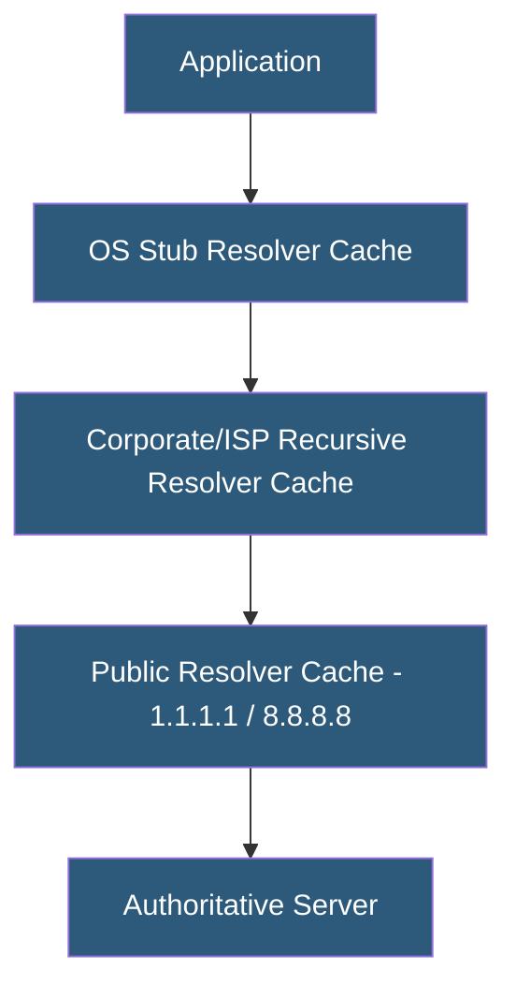

**Category:** DNS Infrastructure
**Difficulty:** Intermediate
**Reading time:** 6 min read

---

DNS caching reduces latency and authoritative server load by storing resolved records at multiple layers: recursive resolvers, operating system stub resolvers, and application-level caches. Effective caching strategy balances freshness requirements against performance, with TTL values, cache sizing, and negative caching policies as primary levers.

- **Resolver Cache** — In-memory store at recursive resolvers holding answers for their TTL duration to serve repeated queries without hitting authoritative servers
- **OS Stub Resolver Cache** — Local DNS cache in the operating system (nscd, systemd-resolved, mDNSResponder on macOS) serving clients on a single host
- **Negative Caching** — Storing NXDOMAIN responses to prevent repeated lookups for non-existent domains
- **Cache Poisoning** — An attack where malicious records are injected into a resolver cache, redirecting traffic to attacker-controlled servers
- **Cache Hit Rate** — The percentage of DNS queries served from cache versus queried to authoritative servers; a key performance metric
- **Prefetching** — Proactively refreshing near-expiry records before their TTL expires to maintain continuous cache availability

DNS caching occurs at multiple layers, each with different scope and lifetime. The OS stub resolver cache is per-machine and short-lived, often ignoring TTLs and expiring entries after a few minutes regardless of authoritative TTL. The recursive resolver cache is shared across all clients using that resolver and honors TTLs precisely.

Large public resolvers like Google (8.8.8.8) and Cloudflare (1.1.1.1) have massive user bases that create high cache hit rates for popular domains. These resolvers maintain gigabytes of cached data across anycast nodes, serving popular records with sub-millisecond latency from hot in-memory stores.

Cache sizing is critical: a resolver with insufficient RAM for its query volume will thrash, constantly evicting recently cached entries. BIND's default cache size of 32MB is inadequate for high-volume resolvers. Production resolvers serving many clients typically allocate 1-8GB for the DNS cache.

Negative caching stores NXDOMAIN responses to prevent repeated failed lookups. The negative cache TTL (from the SOA minimum field) should be set deliberately — too long and valid new domains are blocked; too short and DNS-based filtering is bypassed by creating many subdomains.

Cache prefetching, available in Unbound and PowerDNS Recursor, triggers a background authoritative query when a cached record's TTL falls below a threshold (e.g., 10% of original TTL), ensuring a refreshed record is available before expiry. This eliminates the brief latency spike end-users experience when fetching a stale entry.

- Tuning recursive resolver cache sizing for enterprise deployments
- Configuring negative caching TTLs for security filtering effectiveness
- Analyzing cache hit rates to identify performance optimization opportunities
- Implementing prefetching to eliminate cache expiry latency spikes
- Designing multi-tier caching for high-traffic DNS infrastructure

| Advantage | Disadvantage |
|-----------|--------------|
| High cache hit rates dramatically reduce resolution latency | Stale cache entries delay propagation of DNS changes |
| Negative caching reduces load from invalid domain lookups | Cache poisoning can redirect users to malicious servers |
| Prefetching eliminates TTL expiry latency spikes | Large caches require significant memory allocation |
| OS-level caching reduces recursive resolver load | OS caches may not honor authoritative TTL values precisely |

- [DNS TTL Optimization](dns-ttl-optimization.md)
- [Recursive DNS Resolvers](recursive-dns-resolvers.md)
- [DNS Performance Optimization](dns-performance-optimization.md)

---
*Part of the [DNS Infrastructure](index.md) category · [Back to Master Index](../../index.md)*
