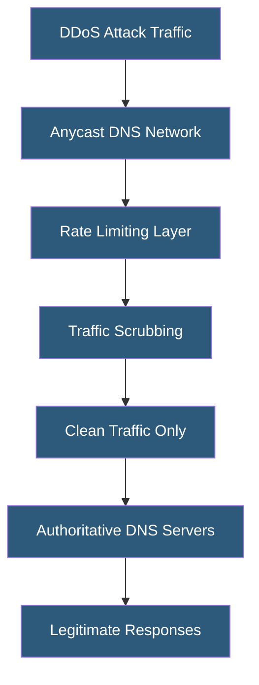

**Category:** DNS Infrastructure
**Difficulty:** Advanced
**Reading time:** 7 min read

---

DNS DDoS mitigation protects authoritative and recursive nameservers from volumetric and application-layer distributed denial-of-service attacks. DNS is both a target (attacks on DNS infrastructure cause domain unavailability) and a vector (amplification attacks exploit open resolvers), requiring defensive measures at multiple infrastructure layers.

- **DNS Amplification** — A DDoS technique exploiting open resolvers: small UDP queries trigger large responses sent to a spoofed victim IP, amplifying attack bandwidth by 28-54x using ANY or DNSSEC-signed queries
- **Response Rate Limiting (RRL)** — A nameserver feature limiting the rate of identical or similar responses sent to a single client IP, defeating amplification
- **ANY Query Deprecation** — RFC 8482 allowing nameservers to return minimal responses to ANY queries, reducing amplification effectiveness
- **BCP38** — Network-level anti-spoofing filtering (Best Current Practice 38) that prevents source IP spoofing at network egress, eliminating amplification attack origins
- **Anycast Scrubbing** — Routing attack traffic to distributed anycast DDoS scrubbing centers that filter malicious packets before forwarding clean traffic
- **Waterhole Attack** — Targeting DNS specifically to take down services that depend on DNS resolution, causing cascading failures

DNS DDoS mitigation requires layered defenses addressing different attack types. Volumetric attacks (UDP floods) against authoritative servers are best defended by anycast distribution — spreading attack traffic across hundreds of nodes globally. A 1Tbps attack targeting a single-region authoritative server is catastrophic; the same attack distributed across 200 anycast nodes is 5Gbps per node, manageable with modern hardware.

Response Rate Limiting (RRL) is implemented in BIND (9.9+), Knot DNS, and PowerDNS, limiting the number of identical or near-identical responses sent to a single IP per second. When a spoofed-source amplification attack causes the server to send large responses to victim IPs, RRL detects the pattern (many identical queries from the same apparent source) and truncates responses or drops them, sending a TRUNCATE flag that asks legitimate clients to retry over TCP. Attackers using UDP spoofing cannot establish TCP connections and thus cannot trigger large responses.

Open resolver elimination is critical for preventing amplification vectors. Recursive resolvers should allow recursion only from authorized client IP ranges (corporate networks, subscriber ranges). Firewalls and ACLs restricting port 53 UDP to internal networks prevent the resolver from being used as an amplifier. Monitoring for open resolver status should be continuous.

For large-scale attacks, DDoS mitigation services (Cloudflare, Akamai, AWS Shield Advanced) provide scrubbing infrastructure: BGP route announcements redirect attack traffic to scrubbing centers with multi-terabit capacity, where signature-based and behavioral filtering removes attack traffic before clean packets reach the target infrastructure.

- Protecting authoritative DNS for critical infrastructure against volumetric attacks
- Hardening corporate recursive resolvers against being weaponized as amplifiers
- Implementing RRL on self-hosted BIND/PowerDNS servers
- Deploying anycast DNS architecture for attack resilience
- Responding to active DNS DDoS attacks with emergency traffic scrubbing

| Advantage | Disadvantage |
|-----------|--------------|
| Anycast inherently distributes and absorbs volumetric attacks | Anycast infrastructure is expensive for small-scale operators |
| RRL prevents amplification with minimal legitimate traffic impact | Aggressive RRL settings may rate-limit legitimate queries from shared IPs |
| BCP38 deployment eliminates spoofed-source attack origin | BCP38 requires upstream network cooperation; not universally deployed |
| Managed DDoS services provide massive scrubbing capacity | Scrubbing services introduce latency and create single-provider dependency |

- [Anycast DNS Architecture](anycast-dns-architecture.md)
- [DNS Security Extensions](dns-security-extensions.md)
- [DNS Infrastructure Redundancy](dns-infrastructure-redundancy.md)

---
*Part of the [DNS Infrastructure](index.md) category · [Back to Master Index](../../index.md)*
