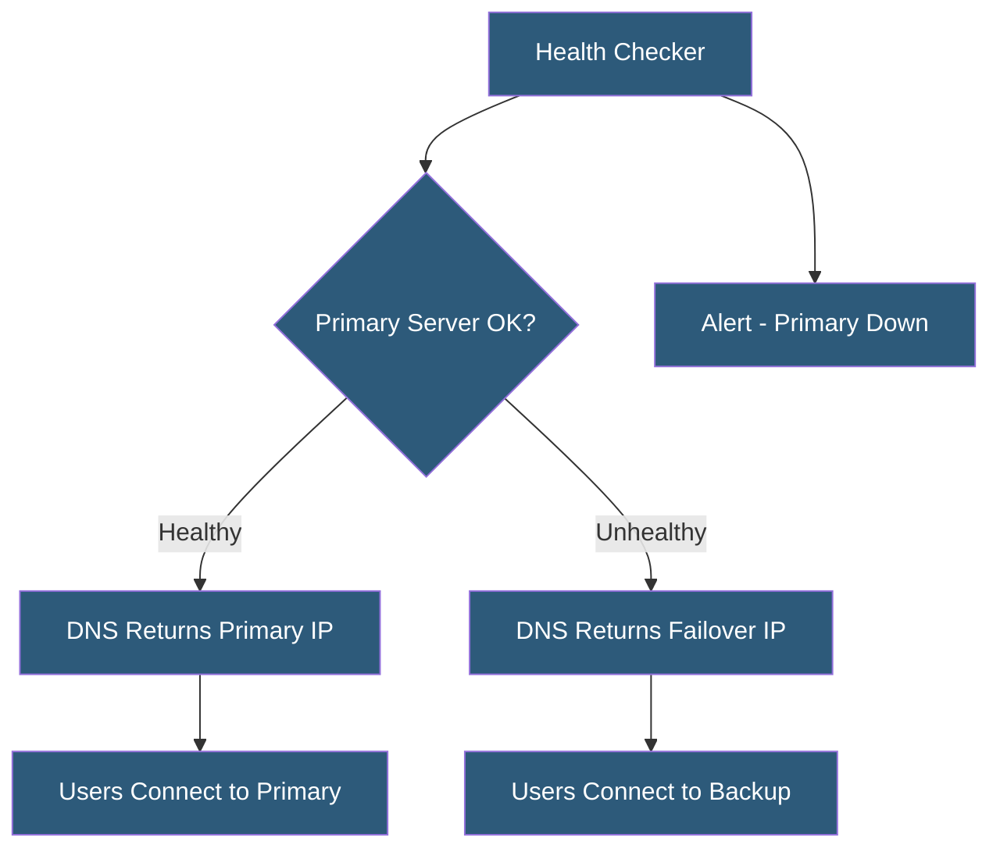

**Category:** DNS Infrastructure
**Difficulty:** Intermediate
**Reading time:** 6 min read

---

DNS failover automatically switches DNS responses from a failed primary server to a backup server based on health check results, minimizing service downtime when infrastructure failures occur. It requires careful TTL tuning, health check design, and failback planning to function effectively in production environments.

- **Primary/Secondary Failover** — A configuration with an active primary server and one or more standby secondaries that receive traffic only when the primary fails
- **Active-Active Failover** — All servers actively receive traffic under normal conditions; failed servers are removed from rotation
- **Health Check Probe** — An automated test (HTTP GET, TCP connect, ICMP ping) validating that a server is functioning correctly
- **Failover TTL** — The low TTL value (typically 30-60 seconds) set on records subject to failover to minimize propagation delay
- **Flap Detection** — Logic preventing rapid oscillation between primary and backup servers due to intermittent health check failures
- **Failback Policy** — The decision of when and how to return traffic to the recovered primary after an outage

DNS failover systems continuously probe servers using health checks configured to mimic real user requests. HTTP health checks typically verify both that the server responds and that the response indicates health (checking for HTTP 200, or specific content in the response body). Failed checks trigger a configurable number of retries before the server is marked unhealthy.

When a server is marked unhealthy, the DNS provider automatically removes its IP from the record set or returns only the backup IP. Critically, the effectiveness of this failover depends on TTL: if the primary record has a 3600-second TTL, clients that cached it before the failure continue using the failed IP for up to an hour. Failover records must use TTLs of 30-60 seconds to minimize this window.

Most managed DNS providers (Route 53, Cloudflare Load Balancing, NS1, UltraDNS) implement health-check-based failover as a managed service, handling probe distribution, flap detection, and TTL management automatically. Route 53 requires health checks to fail from at least one-third of the health checkers in its global network before marking a record unhealthy, reducing false positives from single-region probe failures.

Flap detection is critical in production. Without it, a server experiencing intermittent issues causing alternating health check failures and successes will cause traffic to oscillate between primary and backup, degrading user experience. Implementations use minimum failure windows (e.g., failed for 30 consecutive seconds) and success windows before failback (e.g., successful for 5 minutes before restoring primary).

- Automatic failover for web applications when primary servers become unavailable
- Database connection string failover using DNS for multi-region deployments
- Email server failover using MX record health checks
- API endpoint failover for SaaS applications with uptime SLAs
- Disaster recovery automation as part of a broader business continuity plan

| Advantage | Disadvantage |
|-----------|--------------|
| Automated response faster than manual intervention | Failover speed limited by TTL; 30-60s is best achievable |
| Proactive health checking detects failures before user reports | Health check false positives cause unnecessary failovers |
| Works for any DNS-accessible service | Does not address failures within the TTL window |
| Managed service options reduce operational complexity | Failback requires careful policy to avoid re-introducing instability |

- [Health Check-Based DNS](health-check-based-dns.md)
- [DNS Load Balancing](dns-load-balancing.md)
- [DNS TTL Optimization](dns-ttl-optimization.md)

---
*Part of the [DNS Infrastructure](index.md) category · [Back to Master Index](../../index.md)*
