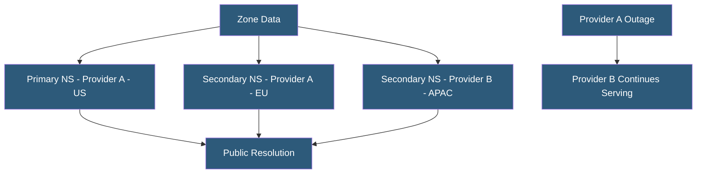

**Category:** DNS Infrastructure
**Difficulty:** Advanced
**Reading time:** 7 min read

---

DNS infrastructure redundancy ensures domain resolution remains available even when individual DNS servers, data centers, or entire providers experience outages. Properly designed redundancy uses multiple geographically distributed nameservers, ideally across different providers, to eliminate single points of failure in the resolution chain.

- **Multi-Provider DNS** — Using two or more DNS providers simultaneously for the same zone to eliminate provider-level single points of failure
- **NS Record Diversity** — Distributing authoritative NS records across multiple providers and geographic locations
- **Hidden Primary** — A master nameserver not listed in public NS records that replicates to public-facing secondary servers, protecting the primary from direct attacks
- **Minimum Two NS Records** — RFC 1035 requirement for at least two distinct nameservers per zone to provide basic redundancy
- **Geographic Distribution** — Placing nameservers in different geographic regions to survive regional network outages
- **Failover Time** — The duration between a primary nameserver failure and clients using an alternate NS; depends on resolver behavior and NS record TTL

DNS redundancy begins with the NS record set for a domain. Registrars submit NS records to the TLD registry when a domain is registered. These NS records must point to at least two nameservers, though production domains should have four to eight. Recursive resolvers round-robin through the NS record set when making authoritative queries, spreading load and providing automatic retry against available servers when one is unreachable.

The most critical redundancy decision is whether to use multiple DNS providers. Single-provider configurations remain vulnerable to provider-wide outages — the 2016 Dyn DDoS attack, the 2021 Fastly outage, and similar events have taken down thousands of domains simultaneously because all their NS records pointed to a single provider. Multi-provider configurations split NS records between two providers (e.g., four NS records: two from Cloudflare, two from NS1). When one provider's infrastructure becomes unavailable, recursive resolvers automatically retry queries against the other provider's NS records.

Multi-provider DNS requires zone data synchronization. The primary DNS provider's zone is replicated to the secondary provider via AXFR zone transfers or API-based synchronization. Tools like octodns, dnscontrol, and terraform DNS providers manage multi-provider zone sync from infrastructure-as-code configurations.

The hidden primary architecture enhances security: a BIND or PowerDNS server not listed in public NS records acts as the zone master. Public-facing secondary servers at multiple providers receive zone transfers from the hidden primary. Attackers cannot target the primary because its IP is not in public DNS. Zone changes are made on the protected primary and replicate automatically.

- Achieving 99.99%+ DNS availability SLAs for critical production domains
- Eliminating single-provider risk for e-commerce domains during high-traffic periods
- Protecting DNS infrastructure against provider-targeted DDoS attacks
- Meeting regulatory requirements for infrastructure resilience in financial services
- Designing DNS architecture for multi-region active-active deployments

| Advantage | Disadvantage |
|-----------|--------------|
| Multi-provider eliminates provider-level single point of failure | Multi-provider zone sync requires additional tooling and operational process |
| Geographic distribution survives regional network outages | Redundant infrastructure costs multiply by the number of providers |
| Hidden primary prevents direct attack on master zone server | Zone propagation delays between providers may cause temporary inconsistency |
| Resolver retry behavior provides automatic failover | NS record TTLs at TLD level (48h) may delay resolver discovery of new NS records |

- [Anycast DNS Architecture](anycast-dns-architecture.md)
- [DNS Failover Configuration](dns-failover-configuration.md)
- [DNS DDoS Mitigation](dns-ddos-mitigation.md)

---
*Part of the [DNS Infrastructure](index.md) category · [Back to Master Index](../../index.md)*
