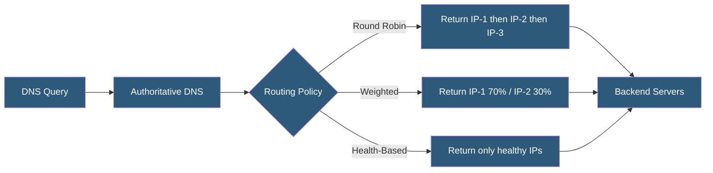

**Category:** DNS Infrastructure
**Difficulty:** Intermediate
**Reading time:** 6 min read

---

DNS load balancing distributes client connections across multiple servers by returning different IP addresses in response to DNS queries. While simpler than application-layer load balancers, DNS-based distribution is widely used for global traffic distribution, multi-datacenter architectures, and traffic steering in conjunction with health checks.

- **Round-Robin DNS** — Returning multiple A records in rotating order so successive clients receive different IPs
- **Weighted Routing** — Assigning traffic percentages to different servers by varying the probability of returning each IP
- **TTL Impact on Balancing** — DNS load balancing effectiveness depends on clients honoring TTLs; sticky sessions defeat distribution
- **Health Check Integration** — Automatically removing unhealthy server IPs from DNS responses to route traffic to available backends
- **Sticky DNS** — Client or CDN caching of a single DNS result, causing a user to repeatedly hit the same server regardless of DNS changes
- **Global Server Load Balancing (GSLB)** — Enterprise DNS-based traffic steering across multiple data centers using health, capacity, and location signals

Round-robin DNS is the simplest form: the authoritative server has multiple A records for a hostname and rotates the order of the returned record set. The first client sees [IP1, IP2, IP3], the second sees [IP2, IP3, IP1], and so on. Most clients use the first IP in the response, achieving approximate equal distribution — though client-side and resolver-side caching mean distribution is never perfectly even.

Weighted DNS routing assigns traffic percentages by adjusting how frequently each IP appears in responses. Route 53 weighted routing uses a weight parameter per record: a server with weight 80 receives 80/(80+20) = 80% of traffic versus one with weight 20. This supports gradual traffic shifts during deployments or canary testing.

DNS-based GSLB integrates health monitoring with routing. Health checkers probe servers every 10-30 seconds via HTTP(S), TCP, or ICMP; unhealthy servers are removed from DNS responses within one TTL cycle. This requires low TTLs (30-60 seconds) to enable rapid failover. NS1, Cloudflare Load Balancing, and Route 53 health-check routing all implement this pattern, combining geographic routing with health-aware response selection.

Limitations are fundamental: DNS load balancing lacks knowledge of server load, active connection counts, or response times. Sticky client DNS caching means a server that becomes slow will continue receiving traffic until TTLs expire. For fine-grained load balancing, DNS distribution should be combined with application-layer load balancers.

- Distributing global traffic across multi-region data centers
- Blue-green deployment traffic shifting via weighted DNS records
- Simple failover for small deployments without a load balancer
- CDN origin selection for different geographic regions
- A/B testing by routing traffic percentages to different server versions

| Advantage | Disadvantage |
|-----------|--------------|
| Simple to implement with no additional infrastructure | Client and resolver caching undermines distribution uniformity |
| Works for any TCP/UDP service, not just HTTP | No knowledge of backend server load or response time |
| Health check integration provides automatic failover | Failover speed limited by TTL; low TTLs increase resolver load |
| Geographic distribution reduces latency globally | Sticky DNS caching creates uneven load distribution in practice |

- [GeoDNS Routing](geodns-routing.md)
- [DNS Failover Configuration](dns-failover-configuration.md)
- [Health Check-Based DNS](health-check-based-dns.md)

---
*Part of the [DNS Infrastructure](index.md) category · [Back to Master Index](../../index.md)*
