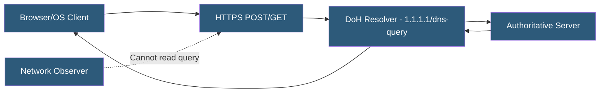

**Category:** DNS Infrastructure
**Difficulty:** Intermediate
**Reading time:** 6 min read

---

DNS over HTTPS (DoH) encrypts DNS queries by sending them as HTTPS requests to a DoH-capable resolver, preventing eavesdropping and manipulation by network intermediaries. It is defined in RFC 8484 and is supported natively by major browsers, operating systems, and DNS resolver software.

- **RFC 8484** — The IETF standard defining the DNS over HTTPS wire format and transport protocol
- **DoH Resolver** — An HTTPS endpoint accepting DNS queries in the application/dns-message content type
- **Browser-Level DoH** — Firefox, Chrome, and Edge implement DoH directly, bypassing the OS resolver
- **HTTPS Encryption** — TLS 1.3 encrypts query content, protecting the queried domain name from passive observation
- **Oblivious DoH (ODoH)** — An extension routing DoH through a proxy to prevent the resolver from learning the client IP address
- **Split Horizon Conflict** — A problem where browser DoH bypasses corporate internal DNS, breaking intranet name resolution

DoH encodes DNS queries as binary DNS messages (application/dns-message) and sends them to a resolver over an HTTPS connection. The wire format is identical to standard DNS but transported over HTTP/2 or HTTP/3, inheriting TLS encryption, certificate-based server authentication, and connection multiplexing.

Queries can be sent as HTTP GET requests with a base64url-encoded dns parameter or as HTTP POST requests with the binary message in the request body. HTTP/2 multiplexing allows multiple DNS queries to share a single TCP connection, reducing latency overhead compared to traditional UDP DNS.

Major browsers have implemented DoH with configurable provider lists. Firefox uses Cloudflare's 1.1.1.1 by default with an "automatic" mode that only activates DoH if no enterprise policy is detected. Chrome's secure DNS feature upgrades the OS-configured resolver to DoH if the same provider offers it. Enterprise administrators can configure group policy to disable or redirect DoH.

The privacy benefit of DoH is primarily against passive network surveillance — ISPs, Wi-Fi operators, and network-level observers cannot read DNS queries. However, the DoH resolver itself sees all queries associated with the client's IP address, centralizing DNS data with a small number of large providers. Oblivious DoH (RFC 9230) addresses this by routing queries through a proxy that removes the client IP before forwarding to the resolver.

- Protecting DNS queries on untrusted public Wi-Fi networks
- Bypassing ISP-level DNS tampering or filtering
- Implementing encrypted DNS for privacy-conscious applications
- Deploying organizational DoH resolvers for corporate endpoint security
- Integrating DoH into mobile applications for consistent DNS behavior

| Advantage | Disadvantage |
|-----------|--------------|
| TLS encryption prevents passive eavesdropping on queries | Centralizes DNS data with major providers, creating privacy risks |
| Authenticated server certificate prevents resolver impersonation | Bypasses corporate split-horizon DNS, breaking internal names |
| Works over port 443, bypassing firewalls blocking port 53 | Slightly higher latency than UDP DNS due to TLS overhead |
| HTTP/2 multiplexing improves connection efficiency | Enterprise monitoring and security filtering bypassed by browser DoH |

- [DNS over TLS (DoT)](dns-over-tls-dot.md)
- [Recursive DNS Resolvers](recursive-dns-resolvers.md)
- [DNS Security Extensions](dns-security-extensions.md)

---
*Part of the [DNS Infrastructure](index.md) category · [Back to Master Index](../../index.md)*
