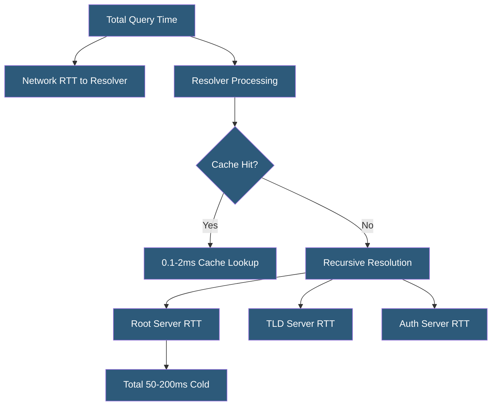

**Category:** DNS Infrastructure
**Difficulty:** Advanced
**Reading time:** 7 min read

---

DNS performance optimization reduces the time from DNS query to resolved IP address, directly impacting application load times and user experience. Techniques span TTL tuning, resolver hardware sizing, anycast deployment, connection protocol selection, and prefetching to minimize both cold and warm lookup latency.

- **Query Latency** — The round-trip time for a DNS query from client to resolver to authoritative server and back
- **Cache Hit Latency** — Resolution time for queries served from resolver cache; typically 0.1-2ms
- **Cold Lookup Latency** — Resolution time for uncached queries requiring the full recursive resolution chain; typically 20-200ms
- **EDNS(0)** — Extension mechanisms for DNS allowing larger UDP packets (up to 4096 bytes) and signaling capabilities like DNSSEC support
- **TCP vs UDP** — DNS uses UDP by default (faster); falls back to TCP for large responses or when indicated by TRUNCATE flag
- **HTTP/3 for DoH** — Using QUIC transport for DoH eliminates TCP head-of-line blocking, improving performance on lossy connections

DNS performance optimization targets each segment of query latency independently. The largest gains come from ensuring queries are served from resolver cache (maximizing cache hit rates) and reducing network distance to resolvers and authoritative servers.

Cache hit rate optimization starts with monitoring: resolver statistics showing cache hit percentage help identify poorly cached domains. TTL values on frequently queried records should be set as high as operationally acceptable (3600-86400 seconds for stable records) to maximize cache lifetime. Resolver cache sizing ensures sufficient memory to hold hot records — a resolver needing to evict popular records due to memory pressure has artificially low hit rates.

Prefetching in Unbound and PowerDNS Recursor maintains continuous cache availability: when a cached record's TTL falls below a threshold (e.g., below 10% of original TTL), the resolver triggers a background query to refresh it before it expires. This eliminates the latency spike users experience when a record expires and the next query triggers a cold recursive lookup.

Authoritative server performance depends on hardware (NVMe-backed zone storage, high clock-speed CPUs for DNSSEC signing), software tuning (large socket buffers, parallel UDP processing), and geographic distribution via anycast. BIND and PowerDNS can handle millions of queries per second on modern hardware, but DNSSEC signing adds significant CPU overhead for large zones with many record types.

DNS resolution for web applications is further accelerated by TCP Fast Open (reduces connection setup), HTTP/2 connection reuse for DoH, and pre-resolve hints in browsers that proactively resolve hostnames referenced in page HTML before the user navigates.

- Reducing web application time-to-first-byte by optimizing DNS resolution speed
- Sizing resolver cache and hardware for high-traffic enterprise deployments
- Configuring prefetching to eliminate cache expiry latency spikes
- Selecting authoritative DNS providers based on latency benchmarks
- Tuning DNSSEC implementation to minimize signing overhead

| Advantage | Disadvantage |
|-----------|--------------|
| Cache optimization provides near-zero latency for hot queries | High TTLs that improve cache hit rate slow DNS change propagation |
| Anycast reduces network RTT to resolver or authoritative server | Anycast infrastructure requires significant operational investment |
| Prefetching eliminates TTL expiry latency spikes for active records | Background prefetch queries increase resolver load |
| EDNS0 large UDP reduces TCP fallback frequency | UDP path MTU issues cause packet loss for large DNSSEC responses |

- [DNS Caching Strategies](dns-caching-strategies.md)
- [DNS TTL Optimization](dns-ttl-optimization.md)
- [Anycast DNS Architecture](anycast-dns-architecture.md)

---
*Part of the [DNS Infrastructure](index.md) category · [Back to Master Index](../../index.md)*
