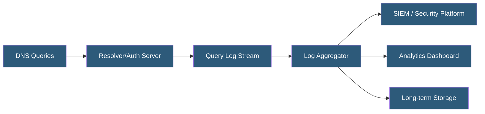

**Category:** DNS Infrastructure
**Difficulty:** Intermediate
**Reading time:** 5 min read

---

DNS query logging captures the DNS requests made by clients, recording the queried name, record type, client IP, response code, and response data. These logs are valuable for security incident investigation, compliance auditing, traffic analysis, and performance monitoring of DNS infrastructure.

- **Query Log** — A record of each DNS query including timestamp, source IP, queried name, record type, and response
- **NXDOMAIN Log** — Logging of failed lookups (non-existent domain responses) used to detect malware C2 beacons and typosquatting
- **RPZ Hit Log** — Events recorded when a query matches a response policy zone rule, indicating a blocked malicious domain lookup
- **Passive DNS** — Aggregate historical records of DNS observations used for threat intelligence and infrastructure mapping
- **Log Aggregation** — Forwarding DNS logs to centralized SIEM systems (Splunk, Elasticsearch) for correlation with other security events
- **Privacy Considerations** — DNS logs reveal user browsing behavior; retention policies and anonymization must balance security and privacy

DNS servers can be configured to log queries at varying verbosity levels. BIND uses a logging stanza with channels directing query log output to files, syslog, or stderr. Unbound writes query logs to its log file when verbosity is set appropriately. PowerDNS supports query logging to databases and Kafka streams for real-time processing.

Query logs typically include: timestamp (millisecond precision), client IP and port, queried name (QNAME), record type (QTYPE), response code (RCODE: NOERROR, NXDOMAIN, SERVFAIL), response time, and the actual records returned. Some implementations log query flags (recursion desired, DNSSEC OK) and EDNS client subnet information.

Security teams use DNS logs as a high-fidelity signal. Malware frequently uses domain generation algorithms (DGAs) that produce unique random-looking domains for command-and-control communication. These appear as NXDOMAIN storms in DNS logs — hundreds of failed lookups from a single host in a short period. Data exfiltration via DNS tunneling (encoding data in DNS query names) creates characteristic patterns of unusually long query names or high query volumes to a single authoritative domain.

Compliance frameworks like PCI DSS and HIPAA require logging of network activity including DNS. Retention periods of 90 days to 1 year are common. Log volume at scale is significant: a mid-sized enterprise generating 100,000 queries per minute produces roughly 5TB of logs per month without compression.

- Detecting malware command-and-control communication via DGA domain patterns
- Investigating security incidents by reconstructing DNS activity timeline
- Compliance auditing for network access logging requirements
- Capacity planning by analyzing query volume and distribution
- Identifying DNS infrastructure performance problems from response time data

| Advantage | Disadvantage |
|-----------|--------------|
| DNS logs reveal network activity at the application naming layer | Full query logging creates significant storage volume at scale |
| NXDOMAIN patterns are reliable indicators of malware activity | DNS logs expose user browsing behavior raising privacy concerns |
| Real-time streaming enables immediate threat detection | High-verbosity logging increases resolver CPU and I/O overhead |
| Centralized aggregation enables cross-host correlation | Log retention policies require legal and privacy review |

- [DNS Analytics and Insights](dns-analytics-and-insights.md)
- [DNS DDoS Mitigation](dns-ddos-mitigation.md)
- [DNS Security Extensions](dns-security-extensions.md)

---
*Part of the [DNS Infrastructure](index.md) category · [Back to Master Index](../../index.md)*
