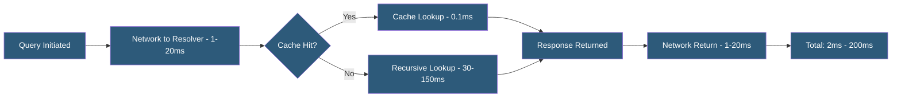

**Category:** DNS Infrastructure
**Difficulty:** Intermediate
**Reading time:** 5 min read

---

DNS query response time measures how long it takes to complete a DNS lookup from query initiation to receiving the answer. It is a critical web performance metric since every uncached DNS lookup adds to page load time, and monitoring response time trends identifies resolver performance degradation before users are affected.

- **TTFB (Time to First Byte)** — Web performance metric that includes DNS resolution time as its first component
- **P95/P99 Latency** — 95th and 99th percentile response times that capture tail latency affecting a subset of users
- **Resolution Time** — Total time from query to answer including network round trips to root, TLD, and authoritative servers for cold lookups
- **Stub Resolver Latency** — The OS-level DNS lookup time measured by applications, including any local cache lookups
- **Probe-Based Monitoring** — Continuous DNS queries from synthetic monitoring nodes measuring authoritative server response times
- **SLA (Service Level Agreement)** — Performance commitments from DNS providers specifying maximum acceptable response times (e.g., 99.9% of queries answered within 100ms)

DNS query response time is measured from the moment a client sends a query to when it receives a response. For cached queries at a nearby resolver, this is typically 1-5ms — dominated by network round-trip time. For cold recursive lookups requiring root server, TLD server, and authoritative server queries, response time is 50-200ms depending on geographic distance.

Web browsers, CDNs, and application servers all measure DNS resolution time separately from TCP connection time and TLS handshake time. Chrome's DevTools Network panel shows DNS Lookup time as the first segment of the connection waterfall. For pages with many third-party scripts from different domains, DNS latency adds up — a page loading resources from 20 domains may incur 20 separate DNS lookups if they occur sequentially.

Browser DNS prefetching (dns-prefetch link hints) resolves hostnames proactively before the user navigates, masking resolution time. HTTP/2 and HTTP/3 server push can reduce domain count. Preconnect hints go further by establishing TCP and TLS connections speculatively.

Monitoring authoritative server response times uses synthetic probes distributed globally. Tools like DNSperf.com, ThousandEyes, and Catchpoint send test queries every 60 seconds from global vantage points and publish percentile latency statistics. Comparing authoritative DNS provider performance guides provider selection — differences of 10-20ms P95 latency matter at scale.

- Benchmarking authoritative DNS provider performance before provider selection
- Setting alerting thresholds for authoritative server latency degradation
- Analyzing DNS latency contribution to web application TTFB
- Optimizing resolver placement for low-latency access from primary user locations
- SLA validation for managed DNS service providers

| Advantage | Disadvantage |
|-----------|--------------|
| Fast DNS resolution improves perceived page load performance | DNS latency is invisible to many monitoring tools measuring only HTTP time |
| Caching eliminates most resolution overhead for repeat users | Cold lookup latency for first-time visitors is irreducible below network RTT |
| Global probe networks reveal geographic performance variance | Synthetic monitoring does not capture real user DNS behavior accurately |
| Percentile metrics reveal tail latency affecting users | Aggressive caching to improve latency conflicts with rapid DNS change needs |

- [DNS Performance Optimization](dns-performance-optimization.md)
- [DNS Caching Strategies](dns-caching-strategies.md)
- [DNS Analytics and Insights](dns-analytics-and-insights.md)

---
*Part of the [DNS Infrastructure](index.md) category · [Back to Master Index](../../index.md)*
