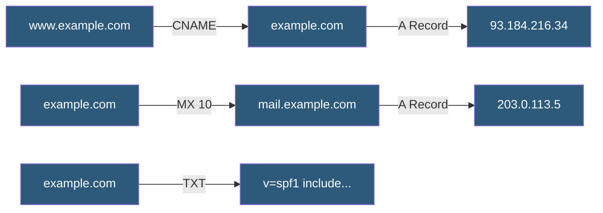

**Category:** DNS Infrastructure
**Difficulty:** Beginner
**Reading time:** 5 min read

---

DNS resource record types define how different kinds of naming information are stored and served. Each record type has a specific purpose: A and AAAA map hostnames to IP addresses, CNAME creates aliases, MX designates mail servers, and dozens of other types handle specialized functions from service discovery to email authentication.

- **A Record** — Maps a hostname to an IPv4 address (32-bit); the most fundamental DNS record type
- **AAAA Record** — Maps a hostname to an IPv6 address (128-bit); essential for modern dual-stack deployments
- **CNAME Record** — Canonical Name record; creates an alias pointing to another hostname rather than an IP address
- **MX Record** — Mail Exchanger record; specifies the mail servers responsible for accepting email for a domain, with priority values
- **TXT Record** — Text record; holds arbitrary string data used for SPF, DKIM, DMARC, and domain verification tokens
- **SOA Record** — Start of Authority; zone metadata including primary nameserver, serial, and timing parameters

A records contain a 32-bit IPv4 address and are the direct mapping from hostname to server. A single hostname can have multiple A records — queried in round-robin by some clients — providing primitive load distribution. AAAA records function identically but for 128-bit IPv6 addresses.

CNAME records redirect resolution to another hostname. When a resolver receives a CNAME response for www.example.com pointing to example.com, it performs another lookup for example.com to get the final IP. CNAME records cannot coexist with other record types at the same name, making them unsuitable at the zone apex — a limitation that led to the ALIAS/ANAME record extension in many DNS providers.

MX records carry a priority value (lower number = higher priority) allowing multiple mail servers with failover behavior. A priority of 10 on the primary server and 20 on a backup means delivery is always attempted to the primary first.

SRV records extend service location: they encode hostname, port, weight, and priority for services like SIP, XMPP, and Kubernetes etcd. NAPTR records support complex rewriting rules for telephony and URI resolution. CAA (Certification Authority Authorization) records specify which CAs may issue SSL certificates for a domain, providing a critical supply-chain security control.

- Pointing a domain to a web server IP with an A record
- Creating www as a CNAME to the apex domain for easier IP management
- Configuring MX records for Google Workspace or Microsoft 365 email
- Adding TXT records for SPF email authentication and domain verification
- Adding AAAA records to enable IPv6 connectivity for dual-stack servers

| Advantage | Disadvantage |
|-----------|--------------|
| Simple A records require no resolver chaining | Multiple A records for load balancing lacks sophistication |
| CNAME simplifies IP management for multiple hostnames | CNAME at zone apex is prohibited by RFC standards |
| MX priority enables mail failover configuration | CNAME chains increase resolution latency |
| TXT records serve many authentication use cases | TXT record accumulation can cause lookup size issues |

- [DNS Zone Files](dns-zone-files.md)
- [DNS TTL Optimization](dns-ttl-optimization.md)
- [DNS Caching Strategies](dns-caching-strategies.md)

---
*Part of the [DNS Infrastructure](index.md) category · [Back to Master Index](../../index.md)*
