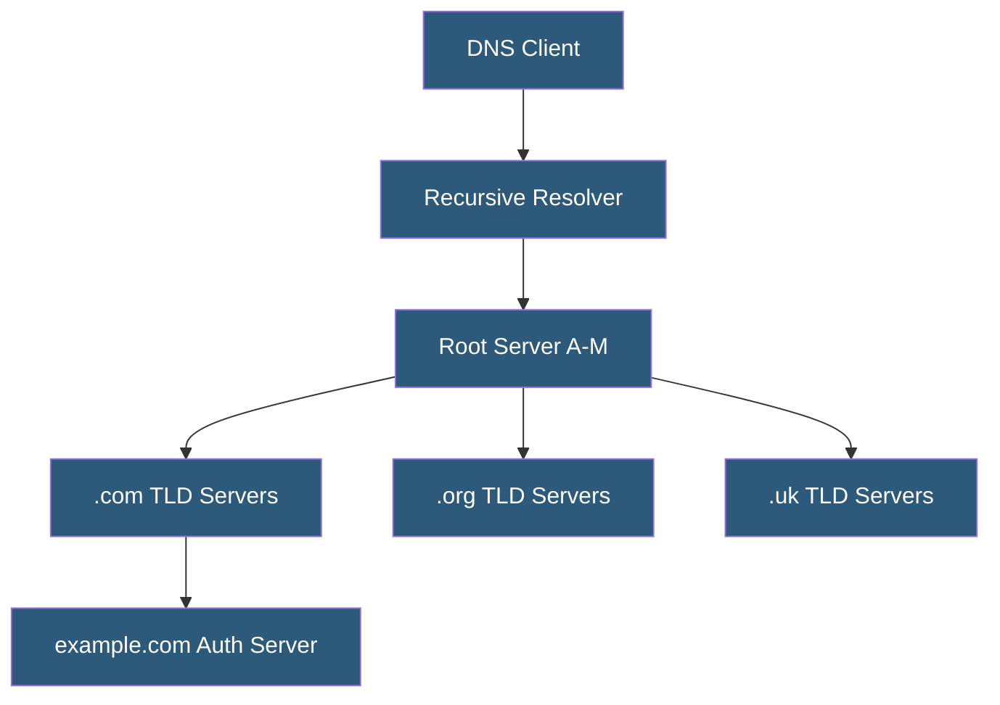

**Category:** DNS Infrastructure
**Difficulty:** Intermediate
**Reading time:** 6 min read

---

DNS root servers are the top of the DNS hierarchy, answering queries about which servers are authoritative for top-level domains (TLDs) like .com, .org, and .uk. Despite the internet relying on 13 root server identities (A through M), anycast networking means thousands of physical nodes worldwide serve root zone data.

- **Root Zone** — The apex of the DNS namespace containing NS records for all top-level domain delegations
- **Root Hints** — A file embedded in resolver software listing the IP addresses of the 13 root server identities used to bootstrap resolution
- **Anycast** — Network routing technique where multiple geographically distributed servers share the same IP address, routing clients to the nearest node
- **IANA** — Internet Assigned Numbers Authority, which administers the root zone on behalf of the global internet community
- **Root Zone File** — The master file listing all TLD delegations, maintained by IANA and distributed to root servers
- **Priming Query** — A resolver's initial query to a root server to populate its cache with current root server information

The DNS namespace has exactly 13 root server identities (labeled A through M) for historical reasons — this number fit within a 512-byte UDP DNS packet when the system was designed. Each identity corresponds to a letter-named cluster operated by different organizations: Verisign operates A and J, USC-ISI operates B, Cogent operates C, University of Maryland operates D, and so on.

Modern anycast deployment means each of the 13 identities is served by hundreds of geographically distributed nodes. The L-root operated by ICANN has over 200 instances worldwide. When a resolver queries 198.41.0.4 (the A-root address), BGP routing directs the packet to the nearest anycast node, not a single physical server.

Root servers respond to queries with referrals, never with direct answers. When asked about example.com, a root server returns the NS records for .com TLD servers and glue records with their IP addresses. Resolvers then query those TLD servers for the authoritative nameservers of example.com.

Root server operators implemented DNSSEC signing of the root zone in 2010. The Root Zone Management System uses a Key Signing Key (KSK) that undergoes periodic key rollovers with substantial ceremony — the 2018 KSK rollover was the first in internet history and required extensive coordination to ensure backward compatibility with all resolvers worldwide.

- Understanding DNS resolution for debugging propagation issues
- Designing resolver infrastructure to minimize root server load
- Implementing DNSSEC trust anchors for root zone validation
- Teaching internet infrastructure and DNS hierarchy concepts
- Planning for DNS resilience in enterprise network architecture

| Advantage | Disadvantage |
|-----------|--------------|
| Anycast provides global low-latency access | Root server compromise would affect the entire internet |
| DNSSEC signatures enable trust chain validation | Root zone changes require coordination across many operators |
| Distributed operation prevents single points of failure | IANA controls delegation of all TLDs |
| Stable infrastructure with decades of operational history | 13 logical identity constraint is a historical artifact |

- [Authoritative DNS Servers](authoritative-dns-servers.md)
- [TLD (Top-Level Domain) Servers](tld-top-level-domain-servers.md)
- [DNSSEC Implementation](dnssec-implementation.md)

---
*Part of the [DNS Infrastructure](index.md) category · [Back to Master Index](../../index.md)*
