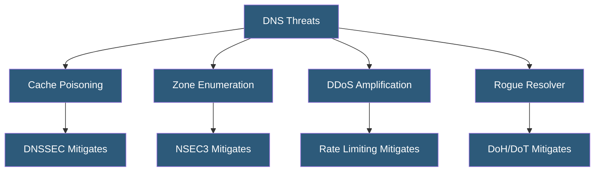

**Category:** DNS Infrastructure
**Difficulty:** Advanced
**Reading time:** 7 min read

---

DNS security extensions encompass DNSSEC plus a range of complementary mechanisms including DNS-based authentication of named entities (DANE), response policy zones (RPZ), and query name minimization. Together these technologies address the multiple attack surfaces inherent in the original, unauthenticated DNS protocol design.

- **DANE (DNS-Based Authentication of Named Entities)** — Uses DNSSEC-secured TLSA records to bind TLS certificates to domain names, enabling certificate pinning via DNS
- **RPZ (Response Policy Zones)** — A mechanism allowing recursive resolvers to override DNS responses for specific domains, used for malware blocking and parental controls
- **DNS Rebinding Attack** — An attack exploiting DNS TTL expiry to change a domain resolution to a private IP address, bypassing same-origin policy
- **DNS Amplification Attack** — A DDoS vector using open resolvers to amplify attack traffic by exploiting the size difference between queries and responses
- **TSIG (Transaction SIGnature)** — An HMAC-based mechanism for authenticating DNS messages between servers, protecting zone transfers
- **CAA (Certification Authority Authorization)** — A DNS record type specifying which certificate authorities are permitted to issue certificates for a domain

DNS security requires a layered approach because the protocol has multiple vulnerability points. At the authoritative server layer, DNSSEC signatures protect record integrity and zone transfers are protected by TSIG authentication — shared secrets that create HMACs over DNS messages, preventing unauthorized zone replication.

At the resolver layer, DNSSEC validation verifies signature chains. RPZ enables resolver-level content filtering: operators publish policy zones mapping malicious domains to synthetic responses (NXDOMAIN or a sinkhole IP), blocking malware communication and phishing attempts before connections are established. Commercial DNS security services like Cisco Umbrella, Cloudflare Gateway, and Akamai Enterprise Threat Protector deliver RPZ-based filtering at scale.

DANE addresses a limitation in the CA system: any CA can issue certificates for any domain, creating supply-chain risk. DANE publishes TLSA records in DNSSEC-secured zones specifying the exact certificate, CA, or public key that should be used for a connection. Email servers implementing SMTP MTA-STS and DANE can validate that the certificate presented by a receiving server matches the TLSA record, preventing downgrade attacks.

DNS amplification attacks exploit open recursive resolvers — servers answering queries from any source IP. Restricting recursion to authorized clients and implementing response rate limiting (RRL) with limits of 5-20 responses per second per source IP/prefix effectively eliminates the attack surface. BCP38 network-level filtering of spoofed source IPs removes the amplification vector entirely.

- Implementing DANE for email security with SMTP TLS enforcement
- Deploying RPZ-based DNS filtering for enterprise security
- Protecting zone transfers with TSIG authentication keys
- Adding CAA records to limit certificate issuance for a domain
- Defending against DNS amplification in ISP and hosting environments

| Advantage | Disadvantage |
|-----------|--------------|
| Layered security addresses multiple attack vectors independently | Each mechanism has independent operational overhead |
| RPZ filtering provides flexible, updatable security policies | RPZ abuse by ISPs has raised censorship concerns |
| DANE eliminates dependence on CA system for certificate trust | DANE requires DNSSEC which many operators have not deployed |
| CAA records provide lightweight certificate issuance control | CAA only limits issuance; cannot revoke existing certificates |

- [DNSSEC Implementation](dnssec-implementation.md)
- [DNS DDoS Mitigation](dns-ddos-mitigation.md)
- [DNS over HTTPS (DoH)](dns-over-https-doh.md)

---
*Part of the [DNS Infrastructure](index.md) category · [Back to Master Index](../../index.md)*
