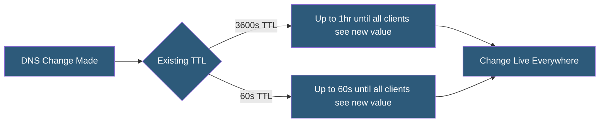

**Category:** DNS Infrastructure
**Difficulty:** Intermediate
**Reading time:** 6 min read

---

DNS TTL (Time-To-Live) is a value in seconds that controls how long resolvers and clients cache a DNS record before requesting a fresh copy. Proper TTL tuning balances propagation speed against resolver load — lower TTLs enable faster changes but increase query volume, while higher TTLs reduce load but slow updates.

- **TTL (Time-To-Live)** — A per-record integer value (in seconds) specifying how long the record may be cached before being re-queried
- **Propagation Delay** — The time for a DNS change to become universally visible, determined by existing cached record TTLs
- **Resolver Cache** — The in-memory store at a recursive resolver holding DNS answers until their TTLs expire
- **Negative TTL** — The TTL applied to NXDOMAIN responses, specifying how long non-existent record answers are cached
- **SOA Minimum TTL** — The SOA record field that sets the default negative caching TTL for the zone
- **TTL Rundown** — The practice of lowering TTLs before a planned DNS change to minimize propagation time

When a recursive resolver receives a DNS answer, it stores the record in its cache along with a timestamp. On each subsequent query for the same record, the resolver returns the cached answer and decrements the TTL. When the TTL reaches zero, the resolver discards the cached entry and queries the authoritative server again.

TTL values set the theoretical maximum propagation delay — the time between making a DNS change and all clients observing the new value. A record with a 3600-second (1-hour) TTL means some clients may continue seeing the old value for up to an hour after the change. In practice, different resolvers will have cached the record at different points in time, so propagation is gradual rather than simultaneous.

For planned changes like IP migrations or provider switches, the best practice is TTL rundown: lower the TTL to 60-300 seconds 24-48 hours before the change (ensuring the old high-TTL cache has cleared), make the change, then raise the TTL back after confirmation. This technique reduces propagation window from hours to minutes.

Different record types warrant different default TTLs. A records for production servers typically use 300-3600 seconds. MX records, which rarely change, can be set to 3600-86400 seconds. TXT records for dynamic verification (DKIM rotation) may use lower values. NS records should have higher TTLs (3600+) since NS changes require coordinated TLD registry updates.

- Migrating a web server to a new IP with minimal downtime exposure
- Setting up blue-green DNS switching for zero-downtime deployments
- Balancing DNS provider load versus propagation speed requirements
- Configuring dynamic DNS for frequently changing IP addresses
- Optimizing TTLs for global CDN edge node performance

| Advantage | Disadvantage |
|-----------|--------------|
| Low TTLs enable rapid DNS changes and failover | Low TTLs dramatically increase authoritative server query volume |
| TTL rundown minimizes propagation windows | Requires advance planning; cannot fix propagation after the fact |
| High TTLs reduce resolver load and improve response times | High TTLs extend outage duration if a DNS change is needed urgently |
| Per-record TTL granularity allows fine-tuned optimization | TTL values in client OS caches may override resolver cache timings |

- [DNS Caching Strategies](dns-caching-strategies.md)
- [DNS Failover Configuration](dns-failover-configuration.md)
- [DNS Performance Optimization](dns-performance-optimization.md)

---
*Part of the [DNS Infrastructure](index.md) category · [Back to Master Index](../../index.md)*
