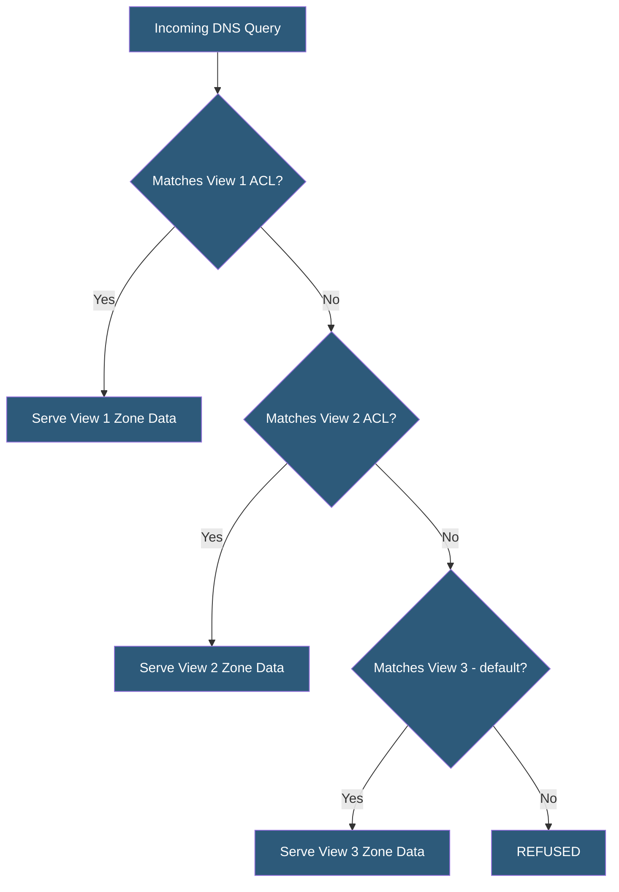

**Category:** DNS Infrastructure
**Difficulty:** Advanced
**Reading time:** 6 min read

---

DNS views allow a single authoritative nameserver to serve different zone data to different clients based on source IP address, TSIG key, or other criteria. Views are the technical mechanism enabling split-horizon DNS, access-controlled zone responses, and environment-specific records from a unified DNS infrastructure.

- **View** — A named BIND configuration block containing match criteria and zone definitions served to matching clients
- **match-clients** — The ACL-based selector determining which queries a view handles
- **View Order** — Views are evaluated sequentially; the first matching view serves the response
- **Recursive View** — A view configuration enabling recursion (full DNS resolution) for trusted internal clients
- **Zone Override** — Using views to return different zone data for the same domain name to different client groups
- **View Consistency** — The requirement that records shared between views (especially NS records) remain consistent to avoid resolver confusion

In BIND, views are configured with the view statement in named.conf. Each view specifies match-clients containing ACL names or inline IP address lists, and contains zone statements defining the zones served to matching clients. All zone definitions must be inside a view block once views are used — there are no global zones when views are configured.

A typical production configuration has three views: internal (matching corporate IP ranges), dmz (matching VPN server or edge IPs with modified records), and external (the default catch-all matching any client). The internal view enables recursion for corporate users; the external view disables recursion to prevent open resolver abuse. Each view contains a version of the same zone with appropriate IP addresses.

Views also support TSIG key-based matching. A secondary nameserver with a TSIG key can be granted access to the internal view via match-clients allowing it to transfer internal zone data. This is useful for secondary servers inside the corporate network that need the full internal zone.

BIND view-per-zone syntax requires each zone file to be duplicated or maintained separately for each view. Configuration management tools (Ansible, Puppet, Terraform with BIND providers) generate zone files from templates parameterized by environment, ensuring consistency. Some operators use $INCLUDE directives with view-specific partial zone files combined with a common base, reducing duplication.

PowerDNS implements views differently: the geo-backend and pipe-backend plugins allow view-like behavior via scripted responses rather than distinct zone definitions, which is more flexible but requires programming.

- Providing internal DNS resolution with recursion for corporate network clients only
- Serving different A records for the same hostname based on client network
- Restricting zone transfers to authorized secondary servers using TSIG key views
- Implementing different DNSSEC signing states per view during key rollover testing
- Supporting multi-tenant hosting where each tenant sees only their own zone data

| Advantage | Disadvantage |
|-----------|--------------|
| Fine-grained control over DNS responses per client group | All zones must be duplicated per view, increasing maintenance burden |
| TSIG key views provide strong authentication for server access | View misconfiguration can serve wrong records to wrong clients |
| Enables recursion for trusted clients without open resolver risk | View order bugs create difficult-to-debug resolution inconsistencies |
| Unified server reduces infrastructure compared to separate internal/external servers | BIND view syntax adds complexity to already complex named.conf files |

- [Split-Horizon DNS](split-horizon-dns.md)
- [Private DNS for VPC](private-dns-for-vpc.md)
- [Authoritative DNS Servers](authoritative-dns-servers.md)

---
*Part of the [DNS Infrastructure](index.md) category · [Back to Master Index](../../index.md)*
