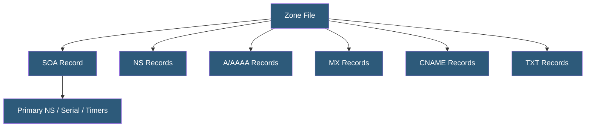

**Category:** DNS Infrastructure
**Difficulty:** Intermediate
**Reading time:** 6 min read

---

DNS zone files are text-based configuration files containing all resource records for a DNS zone, defining how hostnames map to IP addresses and specifying mail servers, text verification strings, and service locations. They are the authoritative source of truth managed by zone administrators and loaded by authoritative name servers.

- **Resource Record (RR)** — A single entry in a zone file specifying a name, record type, TTL, and data
- **Origin ($ORIGIN)** — A zone file directive setting the base domain name for records in the file
- **TTL ($TTL)** — Zone file directive setting the default time-to-live for records without explicit TTL values
- **Serial Number** — An integer in the SOA record incremented whenever the zone is modified, triggering secondary server synchronization
- **BIND Zone File Format** — The de facto standard format defined by RFC 1035, used by BIND and most DNS server software
- **Relative vs Absolute Names** — Relative names in zone files have the $ORIGIN appended; absolute names end with a trailing dot

A zone file begins with a Start of Authority (SOA) record that identifies the primary nameserver, the responsible party's email (with @ replaced by a dot), and five timing parameters: serial number, refresh interval, retry interval, expire time, and minimum TTL for negative caching. The serial number must be incremented on every change — the convention YYYYMMDDNN (date plus two-digit increment) is common.

Following the SOA, NS records list the authoritative nameservers for the zone. These records must match the delegation records at the parent TLD server. A records map hostnames to IPv4 addresses; AAAA records map to IPv6 addresses. MX records specify mail servers with priority values. CNAME records create aliases pointing to canonical names. TXT records hold arbitrary text data used for SPF email authentication, domain ownership verification, and DKIM public keys.

Zone files support a shorthand notation where the @ symbol represents the zone apex (the domain itself). Relative names automatically have $ORIGIN appended. Trailing dots on names are critical — without the dot, the $ORIGIN is appended, creating unintended names.

Modern DNS management platforms like Cloudflare, Route 53, and NS1 abstract zone files into API-managed databases, though they maintain RFC 1035 compatibility for import/export. Zone files remain essential for migrating between providers, backup restoration, and offline auditing of DNS configuration.

- Configuring a BIND or PowerDNS authoritative server from scratch
- Migrating domains between DNS providers via zone file export/import
- Auditing DNS configuration for security review
- Creating zone files for new domain deployments
- Implementing DNSSEC by adding DS and RRSIG records to zone files

| Advantage | Disadvantage |
|-----------|--------------|
| Portable format works across all standards-compliant DNS software | Text format is error-prone; missing trailing dots cause subtle bugs |
| Full visibility into all zone records in one file | Serial number management requires discipline to avoid sync failures |
| RFC 1035 standard ensures broad tool compatibility | Not suitable for large dynamic zones with millions of records |
| Version controllable in git for change tracking | No built-in validation; syntax errors cause zone load failures |

- [Authoritative DNS Servers](authoritative-dns-servers.md)
- [DNS Record Types (A, AAAA, CNAME, MX)](dns-record-types-a-aaaa-cname-mx.md)
- [DNS Zone Transfers](dns-zone-transfers.md)

---
*Part of the [DNS Infrastructure](index.md) category · [Back to Master Index](../../index.md)*
