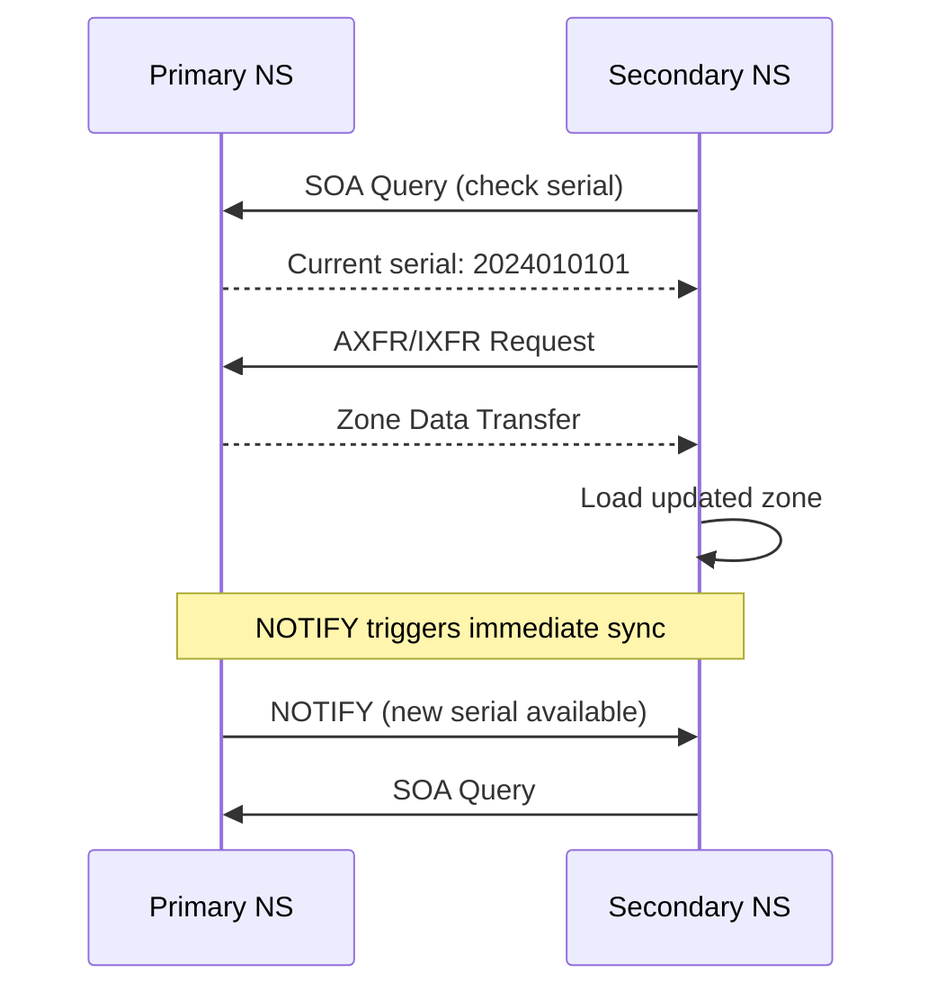

**Category:** DNS Infrastructure
**Difficulty:** Intermediate
**Reading time:** 6 min read

---

DNS zone transfers are the mechanism by which secondary (slave) nameservers synchronize zone data from the primary (master) nameserver. AXFR transfers the complete zone while IXFR transfers only changes since the last synchronization, enabling efficient replication across authoritative nameserver clusters.

- **AXFR (Authoritative Transfer)** — Full zone transfer; transmits the complete zone file from primary to secondary nameserver
- **IXFR (Incremental Transfer)** — Incremental transfer; transmits only zone changes since a specified serial number, reducing bandwidth
- **Serial Number** — The SOA record counter incremented on each zone change; secondary servers compare serials to determine if a transfer is needed
- **Notify** — A DNS mechanism where the primary server actively informs secondary servers of zone changes, triggering pull transfers
- **TSIG Authentication** — Transaction signatures providing HMAC-based authentication of zone transfer messages to prevent unauthorized replication
- **Zone Transfer Access Control** — ACLs restricting which IP addresses or TSIG keys are permitted to initiate zone transfers

Secondary nameservers periodically query the primary for the SOA record and compare the serial number. If the primary serial is higher than the secondary has stored, the secondary initiates a transfer request. For IXFR, it sends the request with its current serial and requests only subsequent changes. The primary responds with difference records since that serial if it maintains an IXFR history; if not, it falls back to a full AXFR.

The Notify mechanism reverses this polling model: when the primary receives a zone update, it immediately sends DNS NOTIFY messages to all configured secondary servers. Secondaries respond with SOA queries and initiate transfers proactively, dramatically reducing the time between a zone change on the primary and replication to secondaries. This is essential for low-TTL zones where propagation speed matters.

Zone transfers must be secured to prevent unauthorized zone enumeration — a full zone transfer exposes every hostname and IP in the zone. TSIG authentication uses shared HMAC-SHA256 keys to authenticate transfer messages between servers. ACLs at the primary restrict transfer requests to the IP addresses of known secondaries. Many organizations also use IP-level firewall rules allowing port 53 TCP (zone transfers use TCP) only from secondary server addresses.

Modern managed DNS providers (Cloudflare, Route 53, NS1) use proprietary internal replication mechanisms rather than AXFR/IXFR between their nodes, though they support RFC-standard zone transfers for external secondary server configurations.

- Replicating zones from a primary nameserver to multiple geographically distributed secondaries
- Migrating zone data between DNS providers using AXFR export
- Maintaining a secondary nameserver at a backup DNS provider for redundancy
- Auditing zone contents via AXFR transfer to a monitoring system
- Integrating self-hosted authoritative servers with a secondary hidden primary architecture

| Advantage | Disadvantage |
|-----------|--------------|
| Standard protocol supported by all RFC-compliant DNS servers | Unrestricted AXFR exposes complete zone data to unauthorized parties |
| IXFR minimizes bandwidth for large zones with frequent changes | IXFR history must be maintained by primary; not all servers support it |
| Notify enables near-instant secondary synchronization | Zone transfer failures create divergence between primary and secondaries |
| TSIG provides strong authentication for transfer messages | TSIG key management adds operational overhead |

- [AXFR and IXFR Protocols](axfr-and-ixfr-protocols.md)
- [DNS Zone Files](dns-zone-files.md)
- [Authoritative DNS Servers](authoritative-dns-servers.md)

---
*Part of the [DNS Infrastructure](index.md) category · [Back to Master Index](../../index.md)*
