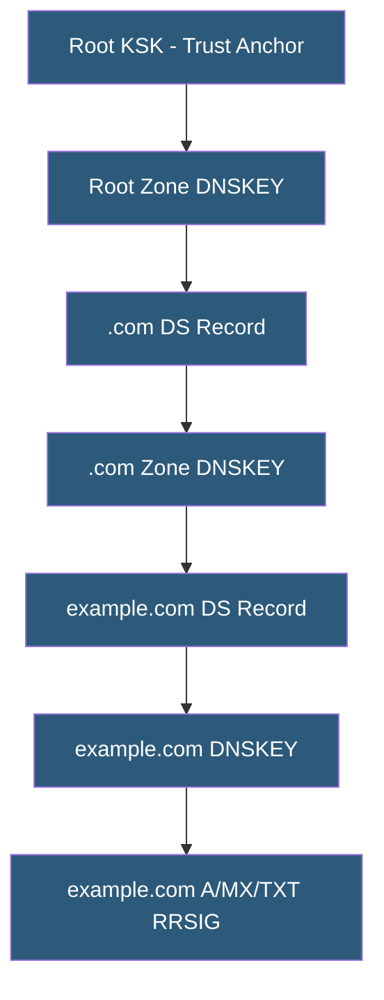

**Category:** DNS Infrastructure
**Difficulty:** Advanced
**Reading time:** 7 min read

---

DNSSEC (Domain Name System Security Extensions) adds cryptographic signatures to DNS records, allowing resolvers to verify that responses are authentic and unmodified. It creates a chain of trust from the DNSSEC-signed root zone down through TLDs to individual domains, protecting against cache poisoning and DNS spoofing attacks.

- **ZSK (Zone Signing Key)** — Cryptographic key used to sign the individual resource records in a zone
- **KSK (Key Signing Key)** — A higher-trust key used to sign the DNSKEY record set, reducing the frequency of trust anchor updates
- **RRSIG** — Resource Record Signature; contains the cryptographic signature for a record set
- **DS Record (Delegation Signer)** — A hash of the child zone KSK published in the parent zone, creating the chain of trust
- **NSEC/NSEC3** — Records proving that a queried name does not exist (authenticated denial of existence)
- **Trust Anchor** — A known public key used as the starting point for DNSSEC chain of trust validation; the root KSK is the ultimate trust anchor

DNSSEC creates a hierarchical chain of cryptographic signatures. At each level, the child zone publishes a DNSKEY record containing its public keys. The ZSK signs all regular resource records in the zone, producing RRSIG records that travel alongside the original records in responses. The KSK signs the DNSKEY record set itself.

The trust link between parent and child zones is the DS record: the child zone operator provides a hash of their KSK to the parent zone, which publishes it as a DS record. When a validating resolver resolves example.com, it retrieves the example.com DNSKEY records, verifies them against the DS record in .com (which it trusts because .com is validated against the root), and then uses the verified ZSK to validate each resource record's RRSIG.

Operators must manage key rollovers regularly. ZSKs are typically rotated monthly or quarterly; KSKs annually or less frequently due to the coordination required to update the parent DS record. The RFC 5011 automatic KSK rollover mechanism allows resolvers to automatically update their trust anchors when they observe a new KSK being pre-published.

NSEC and NSEC3 records solve authenticated denial: when a resolver asks for a non-existent record, the authoritative server returns an NSEC record proving no records exist between two adjacent zone names. NSEC3 uses hashed names to prevent zone enumeration (walking all records by requesting adjacent names).

Implementation requires configuring DNSSEC-capable zone signing in software (BIND, PowerDNS, Knot DNS) or using managed DNS services (Route 53, Cloudflare), publishing the DS record in the parent zone through the registrar, and monitoring for signature expiry.

- Signing government and financial domain zones for maximum security posture
- Protecting against Kaminsky-style DNS cache poisoning attacks
- Enabling DANE (DNS-based Authentication of Named Entities) for TLS certificate validation
- Satisfying compliance requirements for high-security domain operations
- Providing authenticated TLSA records for email security (SMTP MTA-STS)

| Advantage | Disadvantage |
|-----------|--------------|
| Cryptographic proof of record authenticity and integrity | Significantly increases DNS response packet sizes |
| Chain of trust enables end-to-end validation | Key management complexity; expiry causes resolution failures |
| Protects against cache poisoning and man-in-the-middle | Not all recursive resolvers perform DNSSEC validation |
| Enables DANE for stronger TLS certificate validation | Zone enumeration possible with NSEC (mitigated by NSEC3) |

- [DNS Security Extensions](dns-security-extensions.md)
- [Authoritative DNS Servers](authoritative-dns-servers.md)
- [DNS Zone Files](dns-zone-files.md)

---
*Part of the [DNS Infrastructure](index.md) category · [Back to Master Index](../../index.md)*
