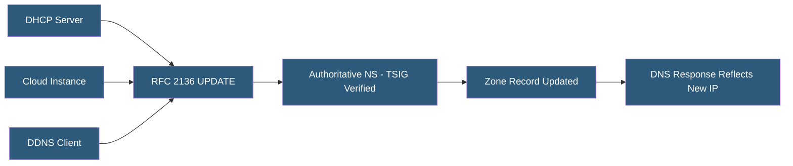

**Category:** DNS Infrastructure
**Difficulty:** Intermediate
**Reading time:** 6 min read

---

Dynamic DNS (DDNS) enables automated, real-time updates to DNS records without manual zone file editing, using the RFC 2136 DNS UPDATE protocol. It is essential for infrastructure that uses dynamically assigned IP addresses, cloud environments with ephemeral resources, and service discovery systems that require DNS as a registry.

- **RFC 2136 (DNS UPDATE)** — The IETF standard for dynamic DNS record updates using a DNS message-based protocol
- **nsupdate** — The standard command-line utility for sending RFC 2136 UPDATE messages to a nameserver
- **TSIG-Authenticated Updates** — Dynamic updates authenticated with HMAC keys to prevent unauthorized record modification
- **Prerequisite** — An RFC 2136 condition that must be true before an update is applied (e.g., record must exist, specific value must match)
- **DDNS Provider** — Services like No-IP, DynDNS, or Cloudflare that accept IP address updates via HTTP API and update DNS records accordingly
- **Service Discovery DNS** — Using DNS dynamic updates as the backend for service registry in distributed systems (Consul, etcd, Kubernetes CoreDNS)

RFC 2136 defines a DNS UPDATE message format extending the DNS protocol to support add, delete, and modify operations on zone records. An UPDATE message specifies a zone, prerequisites (conditions that must hold before the update is applied), and the update operations. The server validates prerequisites and applies updates atomically.

TSIG authentication is mandatory for production DDNS. A TSIG key is configured on the nameserver specifying which zone(s) a key is permitted to update. The nsupdate client signs UPDATE messages with the key, and the server rejects unsigned or incorrectly signed updates. Key policies can restrict a TSIG key to updating only specific record names or types — a DHCP server should only update A records for its assigned clients, not MX or NS records.

Home and small business DDNS uses simplified HTTP-based protocols. Services like Cloudflare, No-IP, and DynDNS accept IP updates via HTTP GET/POST requests from router firmware. Most consumer routers include DDNS client support with preconfigured provider settings. The router detects WAN IP changes and sends update requests automatically, maintaining a resolvable hostname for a dynamic home IP address.

Container orchestration uses DNS-based service discovery extensively. Kubernetes CoreDNS registers Pod and Service records dynamically as workloads start and stop. Consul uses its own DNS server with a dynamically updated catalog. HashiCorp Nomad integrates with Consul DNS for service registration. These systems implement RFC 2136-compatible update mechanisms internally, abstracting DDNS from application developers.

- Maintaining resolvable hostnames for home servers with dynamic ISP-assigned IPs
- Registering cloud instances in DNS automatically on startup via cloud-init
- DHCP server integration to create DNS A records for all assigned leases
- Kubernetes service discovery via CoreDNS dynamic record registration
- IoT device registration using DDNS to maintain connectivity without static IPs

| Advantage | Disadvantage |
|-----------|--------------|
| Eliminates manual DNS record maintenance for dynamic infrastructure | RFC 2136 requires TSIG key management for security |
| Atomic updates with prerequisites prevent race conditions | Dynamic updates may not replicate immediately to secondary servers |
| Integrates with DHCP for automatic hostname-to-IP registration | Not all DNS providers support RFC 2136; many use proprietary APIs |
| Enables DNS as a service registry without separate infrastructure | Update storms from many simultaneous registrations can stress nameservers |

- [DNS Zone Files](dns-zone-files.md)
- [DNS Automation and APIs](dns-automation-and-apis.md)
- [Private DNS for VPC](private-dns-for-vpc.md)

---
*Part of the [DNS Infrastructure](index.md) category · [Back to Master Index](../../index.md)*
