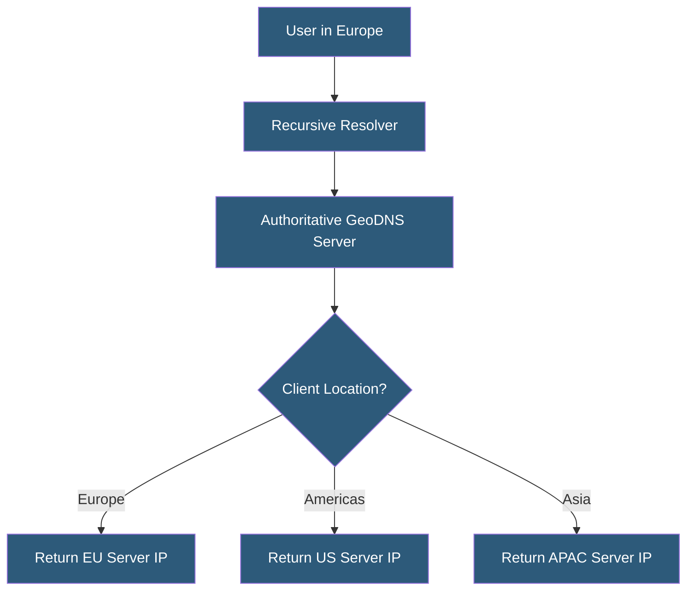

**Category:** DNS Infrastructure
**Difficulty:** Advanced
**Reading time:** 7 min read

---

GeoDNS routes DNS queries to different servers based on the geographic location of the client or resolver, enabling content delivery optimization, regulatory compliance, and latency reduction by returning region-specific IP addresses. It is a foundational technique for global DNS-based traffic management.

- **GeoIP Database** — A mapping of IP address ranges to geographic locations (country, region, city, ASN) used to identify query origin
- **View-Based Routing** — DNS server configuration (BIND views, Route 53 latency routing) serving different record sets to different client groups
- **EDNS Client Subnet (ECS)** — A DNS extension (RFC 7871) allowing resolvers to pass partial client IP information to authoritative servers for more accurate geolocation
- **Anycast vs GeoDNS** — Anycast routes network traffic to the nearest node; GeoDNS routes DNS responses to direct users to specific servers based on location
- **Latency-Based Routing** — A variant of GeoDNS using measured latency to origin rather than geographic proximity to select the optimal endpoint
- **Regional Failover** — Automatically routing traffic away from an unavailable geographic region to a backup region

GeoDNS authoritative servers determine client location from the source IP of the DNS query — either the recursive resolver IP or, if ECS is supported, the partial client subnet. The server looks up the IP in a GeoIP database (MaxMind GeoLite2, IP2Location, or commercial equivalents) to determine country, region, and ASN. Based on configured routing policies, it returns a different A/AAAA record set for each geographic group.

The fundamental challenge is that DNS queries typically arrive at authoritative servers from recursive resolvers, not directly from clients. A corporate resolver in Frankfurt handling queries for users across Europe will appear to the authoritative server as a Frankfurt source, which is usually a reasonable approximation. EDNS Client Subnet extends resolver queries with the first 24 bits (/24) of the client subnet, allowing the authoritative server to make more precise location decisions — important for global content platforms where European and North American clients share the same resolver.

Route 53 Geolocation routing, NS1 Filter Chain, Cloudflare Load Balancing, and DNS Made Easy all implement GeoDNS with different levels of granularity. Route 53 supports routing by continent, country, or US state. NS1 supports custom data sources including latency measurements and custom metadata. Latency-based routing uses periodic probes from each region to measure round-trip times to origin servers, selecting the lowest-latency option rather than the geographically closest.

- Directing European users to EU-hosted servers for GDPR data residency compliance
- Routing media streaming to regional CDN origins for latency optimization
- Geo-blocking or geo-restricting content based on regulatory requirements
- Providing localized content (language, currency, catalog) via region-specific servers
- Load distribution across multiple data centers based on regional traffic patterns

| Advantage | Disadvantage |
|-----------|--------------|
| Reduces latency by routing users to nearest servers | GeoIP databases have 5-15% error rates at city/region granularity |
| Enables data sovereignty compliance with country-level routing | ECS adoption is incomplete; many resolvers do not send client subnet |
| Geographic failover reduces outage blast radius | Low TTLs required for responsive failover increase resolver load |
| Latency-based routing adapts to actual network conditions | Complex to debug; users see different results depending on location |

- [DNS Load Balancing](dns-load-balancing.md)
- [DNS Failover Configuration](dns-failover-configuration.md)
- [Anycast DNS Architecture](anycast-dns-architecture.md)

---
*Part of the [DNS Infrastructure](index.md) category · [Back to Master Index](../../index.md)*
