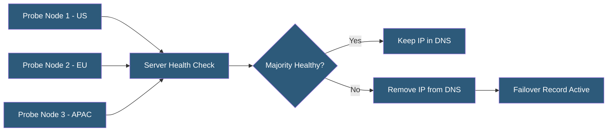

**Category:** DNS Infrastructure
**Difficulty:** Intermediate
**Reading time:** 6 min read

---

Health check-based DNS integrates continuous server monitoring with DNS record management, automatically updating records to reflect server availability. This approach turns DNS into a dynamic traffic steering layer that responds to real-time infrastructure state rather than static configuration.

- **Health Check** — An automated probe testing that a specific server endpoint is functioning correctly and responding within acceptable parameters
- **Probe Network** — A distributed set of monitoring nodes running health checks from multiple geographic locations to avoid single-point false positives
- **RDATA Update** — The dynamic modification of DNS record data (IP addresses) based on health check results
- **Synthetic Monitoring** — Scripted health checks that simulate real user transactions rather than simple connectivity tests
- **Circuit Breaker** — A pattern that stops sending requests to a failing endpoint after a configurable failure threshold, equivalent to removing it from DNS
- **SLA-Based Routing** — Health check policies that route traffic based on service level metrics like latency thresholds rather than binary up/down status

Health check-based DNS systems run continuous probes against each server in the DNS record pool. These probes range from simple TCP connection tests on port 80/443 to full HTTP transaction checks validating status codes and response content, to latency-threshold checks that remove servers exceeding acceptable response times even if technically available.

Probes run from multiple geographic locations to distinguish real outages from network path issues. Route 53 runs health checks from 18 global probe locations; if a server fails checks from a majority of locations, it is marked unhealthy. This prevents a network outage in one region from triggering a global DNS change.

The DNS system continuously monitors health check state and updates records accordingly. In multi-record pools, unhealthy IPs are removed from rotation while healthy ones continue serving traffic. In primary/secondary configurations, the primary IP is removed and the secondary inserted. DNS provider APIs execute these changes automatically, typically within 15-30 seconds of health status change.

Advanced implementations use weighted health scoring. Rather than binary healthy/unhealthy, servers receive health scores based on multiple metrics (response time, error rate, CPU utilization via SNMP). Routing weights in DNS responses are adjusted proportionally — a server with degraded performance receives reduced traffic share rather than complete removal. NS1 and Akamai GTM implement this traffic shaping model.

- Zero-downtime deployment by health-checking new servers before adding to DNS
- Automatic traffic evacuation from degraded servers before complete failure
- Multi-region active-active load balancing with health-aware traffic distribution
- Canary deployment validation by routing small traffic to new servers only when healthy
- Service dependency monitoring triggering DNS changes based on backend health

| Advantage | Disadvantage |
|-----------|--------------|
| Automatic response to infrastructure failures without manual intervention | Probe networks can generate false positives causing unnecessary failover |
| Multiple geographic probe locations reduce false positive rate | Health check costs scale with number of servers and check frequency |
| Weighted scoring enables graceful degradation instead of binary failover | Complex multi-condition health logic is difficult to debug |
| Supports latency-based routing removing slow but available servers | Does not eliminate the TTL window during which clients see stale DNS |

- [DNS Failover Configuration](dns-failover-configuration.md)
- [DNS Load Balancing](dns-load-balancing.md)
- [DNS Analytics and Insights](dns-analytics-and-insights.md)

---
*Part of the [DNS Infrastructure](index.md) category · [Back to Master Index](../../index.md)*
