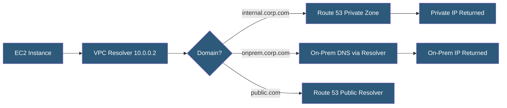

**Category:** DNS Infrastructure
**Difficulty:** Intermediate
**Reading time:** 6 min read

---

Private DNS for VPC (Virtual Private Cloud) enables custom DNS resolution within cloud environments, allowing resources to resolve each other by hostname without using public IP addresses. Cloud providers offer managed private DNS services that integrate with VPC networking, supporting service discovery, microservice communication, and split-horizon resolution.

- **Private Hosted Zone** — A DNS zone that only resolves within associated VPCs, invisible to external DNS queries
- **VPC DNS Resolver** — The cloud provider-managed resolver at the VPC base address plus two (e.g., 10.0.0.2 in a 10.0.0.0/16 VPC)
- **Route 53 Resolver** — AWS managed DNS service providing inbound and outbound resolution rules for hybrid cloud DNS
- **Cloud DNS Private Zone** — GCP equivalent of private hosted zones with fine-grained VPC association
- **Azure Private DNS Zones** — Azure managed DNS for private name resolution within virtual networks
- **Resolver Endpoints** — IP endpoints for forwarding DNS queries between on-premises networks and cloud VPCs

Cloud VPCs include a built-in DNS resolver at the network base address plus two (the .2 address of the VPC CIDR range). This resolver automatically handles resolution for the cloud provider's internal namespaces (EC2 instance hostnames, RDS endpoints, ELB DNS names) and forwards other queries to public DNS. Private hosted zones extend this resolver with custom DNS data visible only to associated VPCs.

AWS Route 53 private hosted zones allow any DNS namespace (including a domain you also use publicly) to be resolved differently inside the VPC. Associating a private zone for api.example.com with a VPC causes all instances in that VPC to resolve api.example.com to its private IP, while external clients continue seeing the public IP. This is the cloud-native implementation of split-horizon DNS.

For hybrid cloud environments connecting VPCs to on-premises networks, Route 53 Resolver provides inbound and outbound endpoints. Inbound endpoints give on-premises DNS servers an IP address to forward cloud domain queries to. Outbound endpoints, combined with forwarding rules, route cloud queries for on-premises domains to the on-premises DNS servers. This creates bidirectional name resolution across the VPN or Direct Connect link.

Private DNS also underlies VPC endpoint DNS: when an AWS PrivateLink endpoint is created, a private hosted zone is automatically created so that service hostnames (e.g., vpce-xxx.s3.us-east-1.vpce.amazonaws.com) resolve to the endpoint ENI private IP address, routing traffic through the private link instead of the internet.

- Service discovery between microservices in a VPC using DNS hostnames
- Implementing split-horizon DNS for internal vs external service access
- Connecting on-premises DNS to cloud DNS in hybrid cloud deployments
- Routing cloud service traffic through VPC endpoints using private DNS
- Multi-account DNS resolution using Route 53 Resolver sharing

| Advantage | Disadvantage |
|-----------|--------------|
| Managed service eliminates DNS server operational overhead | Private zones must be explicitly associated with each VPC that needs access |
| Integrates natively with cloud networking (VPC, PrivateLink) | Cross-account and cross-region resolution requires additional configuration |
| Automatic failover and high availability from cloud provider | Vendor lock-in to provider-specific DNS abstractions |
| Supports split-horizon without separate server infrastructure | Debugging private DNS resolution requires cloud console access |

- [Split-Horizon DNS](split-horizon-dns.md)
- [DNS Views Configuration](dns-views-configuration.md)
- [Dynamic DNS Updates](dynamic-dns-updates.md)

---
*Part of the [DNS Infrastructure](index.md) category · [Back to Master Index](../../index.md)*
