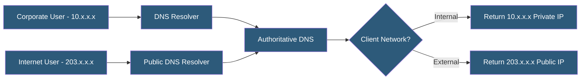

**Category:** DNS Infrastructure
**Difficulty:** Advanced
**Reading time:** 6 min read

---

Split-horizon DNS serves different DNS responses to different clients for the same hostname, most commonly returning internal IP addresses to corporate network users and public IP addresses to external internet users. It is fundamental to separating internal service discovery from external resolution in enterprise and hybrid cloud environments.

- **Split-Horizon (Split-Brain) DNS** — A configuration where the same zone exists in two separate versions: one for internal networks and one for external networks
- **BIND Views** — The mechanism in BIND nameserver for serving different zone data based on client source IP, TSIG key, or other criteria
- **Internal Zone** — The version of a zone containing private IP addresses, internal hostnames, and development/staging records
- **External Zone** — The public-facing version of a zone with only externally accessible servers and public IP addresses
- **ACL (Access Control List)** — IP address ranges or subnets used to classify incoming queries for view selection
- **Private DNS Namespace** — Internal-only hostnames (e.g., app.internal.example.com) that must not leak to public DNS

In BIND, split-horizon is implemented through the views directive. Each view defines match criteria (match-clients using ACLs or TSIG keys) and contains zone definitions. A query from a corporate IP range matches the internal view and receives the internal zone data; queries from other IPs match the external view. Views are evaluated in order and the first match wins.

Cloud environments implement split-horizon through separate resolver configurations. AWS Route 53 Resolver uses private hosted zones associated with a VPC that override public zone resolution for internal clients. Azure Private DNS Zones and Google Cloud DNS private zones follow the same model — a private zone for a public domain returns private IP addresses to VPC-internal clients while public DNS continues serving the same domain's public records globally.

A critical operational concern is consistency maintenance. When internal and external zones diverge significantly (different record sets, different subdomains), changes must be applied to both zones independently. Automation tools like Terraform, Pulumi, or custom scripts help synchronize records that must exist in both zones.

Split-horizon also requires careful DoH/DoT handling. If corporate users enable browser-level DoH (bypassing the corporate resolver), they may resolve internal hostnames against public DNS and receive NXDOMAIN or, worse, resolve them against incorrect records if the domain is also registered externally. Enterprise DNS policies must configure DoH to use the corporate resolver or disable browser DoH via group policy.

- Returning private IP addresses to VPN users connecting to internal services
- Providing internal staging environments under production domains without exposing them externally
- Implementing service discovery in hybrid cloud with internal hostnames
- Securing internal application URLs from external enumeration
- Supporting regulatory requirements to limit internal network topology exposure

| Advantage | Disadvantage |
|-----------|--------------|
| Internal users access services via private IPs avoiding hairpinning | Maintaining two zone versions doubles operational complexity |
| Internal hostnames invisible to external DNS enumeration | Browser DoH can bypass corporate resolver, breaking internal resolution |
| Private namespaces for dev/staging remain isolated from public DNS | Inconsistency between internal and external zones causes intermittent issues |
| Supports different record sets per environment without domain changes | Debugging split-horizon issues requires knowing client network context |

- [DNS Views Configuration](dns-views-configuration.md)
- [Private DNS for VPC](private-dns-for-vpc.md)
- [Authoritative DNS Servers](authoritative-dns-servers.md)

---
*Part of the [DNS Infrastructure](index.md) category · [Back to Master Index](../../index.md)*
