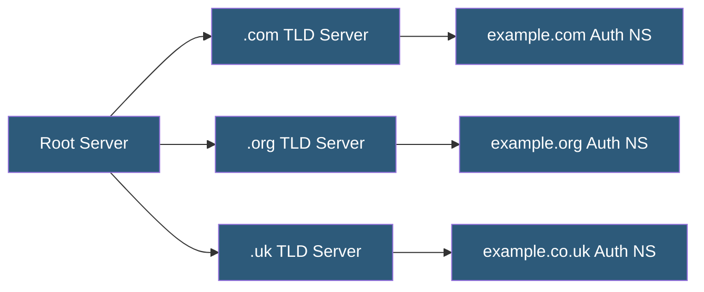

**Category:** DNS Infrastructure
**Difficulty:** Intermediate
**Reading time:** 6 min read

---

TLD servers are authoritative nameservers for top-level domains such as .com, .org, .net, and country-code TLDs like .uk and .de. They sit one level below root servers in the DNS hierarchy, responding to queries by delegating authority to the authoritative nameservers for individual domains within their TLD.

- **gTLD (Generic TLD)** — Top-level domains not associated with a specific country: .com, .org, .net, .info, and thousands of new gTLDs like .cloud, .app, .io
- **ccTLD (Country-Code TLD)** — Two-letter TLDs assigned to specific countries or territories: .uk, .de, .jp, .au
- **Registry Operator** — The organization authorized by ICANN to manage a TLD; Verisign operates .com and .net
- **Registrar** — Companies accredited to sell domain registrations within a TLD to end users
- **Registry-Registrar-Registrant Model** — The three-tier hierarchy governing domain registration and management
- **EPP (Extensible Provisioning Protocol)** — The standardized protocol used for communication between registrars and registry operators

TLD servers maintain delegation records for every domain registered within their TLD. For .com, Verisign operates a database of over 160 million domain registrations, each with associated NS records pointing to authoritative nameservers designated by the domain owner. When a recursive resolver queries a .com TLD server about example.com, the TLD server returns NS records like ns1.exampledns.com along with glue records providing the IP addresses of those nameservers.

The registry operator runs a highly available, anycast-distributed TLD server infrastructure. The .com zone is served by 13 nameserver clusters (a.gtld-servers.net through m.gtld-servers.net) using anycast with hundreds of nodes worldwide, processing hundreds of billions of queries daily.

Registrars update the TLD registry database via EPP when customers purchase or modify domains. Changes to NS records propagate through the registry database to TLD name servers within minutes, though cached records at resolvers may take up to the TTL value (typically 48 hours for TLD delegations) to refresh globally.

ICANN's new gTLD program launched in 2012 expanded the TLD namespace from a few hundred to over 1,200 gTLDs. Each new gTLD requires its operator to meet technical standards for TLD server reliability, including minimum latency requirements and mandatory DNSSEC signing, audited by ICANN.

- Understanding domain registration and delegation infrastructure
- Diagnosing delegation issues when domains resolve incorrectly after NS changes
- Planning domain strategy across multiple TLDs for brand protection
- Implementing premium domains under new gTLDs for product launches
- Understanding DNSSEC trust chain from root through TLD to domain

| Advantage | Disadvantage |
|-----------|--------------|
| Highly available infrastructure operated by specialized registries | TLD registry operators are chokepoints for delegation updates |
| Fast delegation propagation via EPP integration | TTL for TLD delegation records is set by the registry, not the domain owner |
| DNSSEC signing provides cryptographic chain of trust | Registry outages can affect resolution of all domains in a TLD |
| Mature ecosystem with established registrar competition | New gTLD proliferation creates consumer confusion |

- [DNS Root Servers](dns-root-servers.md)
- [Authoritative DNS Servers](authoritative-dns-servers.md)
- [DNS Zone Files](dns-zone-files.md)

---
*Part of the [DNS Infrastructure](index.md) category · [Back to Master Index](../../index.md)*
