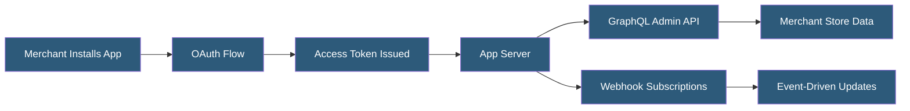

**Category:** E-commerce Hosting Platforms
**Difficulty:** Intermediate
**Reading time:** 5 min read

---

The Shopify App Store is a marketplace of over 8,000 third-party applications that extend Shopify functionality across marketing, fulfillment, analytics, customer service, and more. Apps are built by independent developers using Shopify APIs and can be installed by merchants to customize their store operations without custom development.

- **Public App** — An app listed in the Shopify App Store, available for any merchant to install
- **Custom App** — A private app built for a specific merchant, accessible only to that store
- **App Bridge** — Shopifys JavaScript library enabling apps embedded in the Shopify Admin to behave like native admin features
- **OAuth 2.0 Installation** — The flow by which merchants grant app access to their store data during installation
- **Billing API** — Shopifys managed subscription billing system for app developers to charge merchants without building payment infrastructure
- **App Review** — Shopifys process of reviewing new apps for security, functionality, and quality before they appear in the App Store

Shopify apps are external web applications that integrate with stores via Shopify APIs. During installation, merchants authorize the app through OAuth 2.0, granting specific API permissions (scopes) like read_products, write_orders, or read_customers. The app receives a permanent access token for that store's API.

Most apps are embedded — they render their UI inside an iframe in the Shopify Admin, using App Bridge to communicate with the host Shopify Admin interface for navigation, modals, and toasts. This embedding creates a seamless UX where apps feel native rather than external.

App developers monetize through Shopify's Billing API, which manages subscription and one-time charges billed through Shopify's payment system. Merchants see app charges on their Shopify invoice, reducing friction compared to managing separate subscriptions. The revenue share is 80% to developers (Shopify takes 20%, reduced to 0% on the first $1M annual revenue as of 2021).

Shopify evaluates apps before App Store listing: apps must pass security review (no credential logging, proper OAuth implementation), functionality review (works as described, no crashes), and quality review (proper admin embedding, performance benchmarks). Maintained review scores and merchant ratings determine App Store ranking and feature placement.

- Adding email marketing automation without custom development
- Installing product review and social proof functionality
- Connecting store inventory to multi-channel fulfillment providers
- Adding loyalty programs and referral mechanics
- Integrating ERP and accounting systems via specialized apps

| Advantage | Disadvantage |
|-----------|--------------|
| Vast app catalog reduces custom development for common needs | App proliferation increases monthly costs and potential performance impact |
| Managed billing reduces developer payment infrastructure burden | App data stored on third-party servers outside Shopify infrastructure |
| Review process provides basic quality and security assurance | App breakages from Shopify API updates can disrupt store operations |
| Embedding model creates seamless merchant UX | Popular apps become dependencies difficult to remove without disruption |

- [Shopify Platform Architecture](shopify-platform-architecture.md)
- [Shopify GraphQL Admin API](shopify-graphql-admin-api.md)
- [Shopify Webhook Events](shopify-webhook-events.md)

---
*Part of the [E-commerce Hosting Platforms](index.md) category · [Back to Master Index](../../index.md)*
