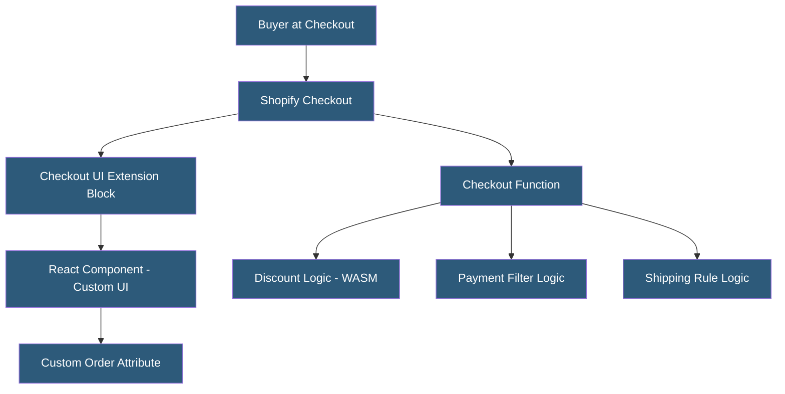

**Category:** E-commerce Hosting Platforms
**Difficulty:** Advanced
**Reading time:** 7 min read

---

Shopify checkout customization allows merchants to modify the checkout experience using Checkout UI Extensions and Checkout Functions. Plus merchants can add custom fields, loyalty integrations, delivery customizations, and branding elements, while Checkout Functions enable serverless logic for discounts, payment filtering, and shipping rules.

- **Checkout UI Extensions** — React-based components rendered within the Shopify checkout that can add custom UI blocks above/below existing checkout elements
- **Checkout Functions** — Serverless WebAssembly functions running in Shopifys infrastructure that customize checkout logic (discounts, payment methods, shipping)
- **Branding API** — A Plus-exclusive API for applying brand colors, typography, and logo to the Shopify-hosted checkout page
- **Post-Purchase Extensions** — UI components displayed after payment on the order status page for upsells, surveys, and loyalty enrollment
- **Address Autocompletion** — Built-in address validation and autocomplete powered by Google Maps integration
- **Custom Fields** — Merchant-added checkout inputs (gift messages, delivery date selectors) stored as order attributes

Checkout UI Extensions are built with React and Shopify's Checkout UI toolkit. Developers define extension points — specific locations in the checkout flow where their component can render (before shipping address, after payment method, etc.). The component has read access to checkout state (cart contents, buyer identity, shipping selections) and can write to order attributes and custom line item properties.

Extensions are deployed as JavaScript bundles hosted on Shopify's CDN, instantiated within a sandboxed iframe at runtime. The sandbox prevents extensions from accessing buyer payment data or interfering with core checkout functionality. Communication between the extension and the host checkout page uses a message-passing API provided by the Checkout UI kit.

Checkout Functions are compiled to WebAssembly (WASM) and executed in Shopify's serverless infrastructure with a maximum execution time of 5ms. This tight constraint ensures checkout latency remains minimal regardless of custom logic. Functions receive a structured input (cart state, buyer, configuration) and return an output (modified discounts, filtered payment methods, shipping line additions). The WASM compilation model eliminates external network calls from within checkout logic.

Branding configuration via the Branding API applies merchant brand identity to the checkout hosted by Shopify. Merchants set primary/secondary colors, button corner radius, font family, and logo, creating visual consistency between their storefront and the payment page without compromising the PCI-compliant hosting Shopify provides.

- Adding gift message fields to checkout for holiday campaigns
- Integrating loyalty point balance display at checkout for redemption
- Implementing volume discount logic for B2B orders
- Filtering available payment methods based on cart contents or customer type
- Adding custom delivery date picker for merchants with specific fulfillment schedules

| Advantage | Disadvantage |
|-----------|--------------|
| UI Extensions provide customization without leaving Shopify PCI scope | Limited to Plus merchants; standard plans cannot customize checkout |
| WASM functions guarantee sub-5ms execution for checkout logic | WASM compilation learning curve; requires Rust or AssemblyScript knowledge |
| Sandbox prevents extension code from accessing payment data | Extension points limited to Shopify-defined locations in checkout flow |
| Branding API maintains Shopify hosting while improving visual consistency | Full custom checkout requires headless implementation via Hydrogen |

- [Shopify Plus Enterprise Features](shopify-plus-enterprise-features.md)
- [Shopify Functions Serverless](shopify-functions-serverless.md)
- [Shopify Hydrogen Headless Framework](shopify-hydrogen-headless-framework.md)

---
*Part of the [E-commerce Hosting Platforms](index.md) category · [Back to Master Index](../../index.md)*
