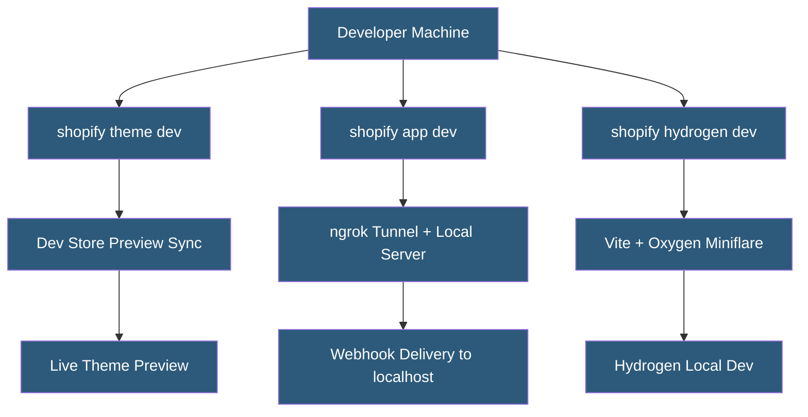

**Category:** E-commerce Hosting Platforms
**Difficulty:** Intermediate
**Reading time:** 5 min read

---

Shopify CLI is the official command-line tool for developing Shopify apps, themes, and Hydrogen storefronts. It provides scaffolding, local development with live preview, deployment, and environment management, integrating the Shopify development workflow into a unified command interface.

- **shopify app dev** — Starts the local app development server with ngrok tunnel for Shopify webhook delivery to localhost
- **shopify theme dev** — Starts a live preview connection between local theme files and a development store
- **shopify hydrogen dev** — Runs the Hydrogen development server with Vite HMR and Oxygen-compatible runtime simulation
- **App Scaffold** — CLI-generated starter project structure for Shopify apps with authentication, routing, and API client boilerplate
- **Environment Config** — The shopify.app.toml configuration file declaring app settings, scopes, and extensions
- **Extension CLI** — Commands for developing, previewing, and deploying Shopify app extensions (UI extensions, functions)

Shopify CLI authenticates with a Shopify partner or merchant account using browser-based OAuth. After authentication, CLI commands operate against the configured store or partner organization. The CLI stores credentials securely and refreshes tokens automatically.

For theme development, `shopify theme dev` establishes a bidirectional file watch and sync session. Local file changes are pushed to the development store's theme immediately; theme settings changes in the admin are optionally pulled back. The preview URL opens the development store with the local theme applied, showing live changes as files are saved.

App development uses `shopify app dev` to start the local Node.js app server and create an ngrok tunnel. Shopify requires HTTPS endpoints for webhook delivery and OAuth redirects; the ngrok tunnel provides this without SSL certificate configuration. The CLI registers the tunnel URL with the app configuration automatically during the session.

Hydrogen development uses `shopify hydrogen dev` to start a Vite dev server with Miniflare — a local implementation of the Cloudflare Workers runtime. This simulates the Oxygen production environment locally, including Workers APIs, KV storage, and environment variable access, reducing the gap between local development and edge deployment behavior.

- Setting up a new Shopify theme development project from scratch
- Developing and testing Shopify app authentication flows locally
- Building and previewing Checkout UI Extensions with live reload
- Deploying theme and app updates to production stores
- Managing multiple development store environments for different clients

| Advantage | Disadvantage |
|-----------|--------------|
| Unified CLI reduces tool sprawl across theme/app/hydrogen workflows | ngrok tunnel creates external dependency for app development |
| Live preview eliminates deploy-refresh cycle in theme development | CLI requires authentication which may expire and need re-login |
| Miniflare accurately simulates Oxygen Workers environment locally | Some Cloudflare Workers APIs have gaps in Miniflare implementation |
| App scaffolding accelerates new project setup | Generated boilerplate is opinionated; non-standard architectures require cleanup |

- [Shopify Theme Development](shopify-theme-development.md)
- [Shopify Hydrogen Headless Framework](shopify-hydrogen-headless-framework.md)
- [Shopify App Store Ecosystem](shopify-app-store-ecosystem.md)

---
*Part of the [E-commerce Hosting Platforms](index.md) category · [Back to Master Index](../../index.md)*
