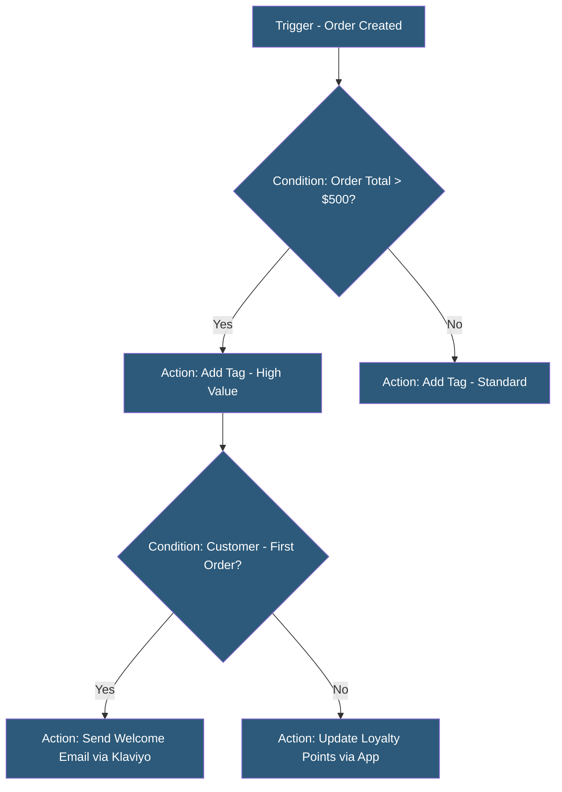

**Category:** E-commerce Hosting Platforms
**Difficulty:** Intermediate
**Reading time:** 5 min read

---

Shopify Flow is a visual workflow automation tool exclusive to Shopify Plus that enables merchants to automate repetitive tasks without code. Workflows trigger on Shopify events and execute actions across Shopify and connected apps, eliminating manual processes for order management, customer segmentation, and inventory operations.

- **Trigger** — The Shopify event that starts a workflow (e.g., Order Created, Customer Updated, Inventory Level Changed)
- **Condition** — Logic gates in the workflow that branch execution based on data (e.g., order total > $500, customer tag contains "VIP")
- **Action** — The operation performed when conditions are met (e.g., add tag, send email, create metafield, fulfill order)
- **Template** — Pre-built workflow configurations for common use cases available in Shopify Flow template library
- **Delay** — A workflow step that pauses execution for a specified duration before proceeding to the next action
- **Flow Connector** — Third-party app integrations extending available triggers and actions beyond native Shopify operations

Flow workflows are built in a visual editor with a canvas where triggers, conditions, and actions are connected by arrows. Each component is configured with a form selecting from available options relevant to that step type. Conditions use a filter syntax supporting equals, contains, greater than, and is set/unset operators against Shopify resource properties.

Available triggers span order events (created, paid, fulfilled, refunded), customer events (created, updated, placed order count milestones), product events (created, inventory changed), and app-specific triggers from Flow Connector integrations. Each trigger type exposes relevant data properties usable in conditions and actions.

Actions within Shopify include: adding/removing customer tags, adding/removing order tags, sending Shopify Admin notifications, fulfilling orders from specific locations, adding timeline comments, creating metafield values, and hiding/unhiding products. Many popular apps (Klaviyo, Postscript, Gorgias, Loop Returns, Yotpo) publish Flow Connectors exposing their own triggers and actions.

Delay steps pause workflow execution for minutes, hours, or days before continuing, enabling time-based sequences: send an SMS 3 hours after abandoned checkout, send a follow-up review request 7 days after order delivery, or flag orders still unfulfilled after 5 business days.

- Auto-tagging high-value customers for loyalty tier management
- Sending fraud alert notifications for orders flagged as high risk
- Hiding out-of-stock products automatically when inventory reaches zero
- Routing specific order types to specific warehouse locations
- Triggering post-purchase email sequences in connected email platforms

| Advantage | Disadvantage |
|-----------|--------------|
| No-code interface enables merchant self-service automation | Exclusive to Shopify Plus; not available on lower plan tiers |
| Template library reduces time to configure common workflows | Complex multi-step logic can become difficult to debug visually |
| Flow Connectors extend automation to third-party app ecosystem | Cannot make arbitrary API calls; limited to configured connector actions |
| Delay steps enable time-based automation sequences | Workflow execution is asynchronous; not suitable for checkout-time decisions |

- [Shopify Plus Enterprise Features](shopify-plus-enterprise-features.md)
- [Shopify Webhook Events](shopify-webhook-events.md)
- [Shopify Functions Serverless](shopify-functions-serverless.md)

---
*Part of the [E-commerce Hosting Platforms](index.md) category · [Back to Master Index](../../index.md)*
