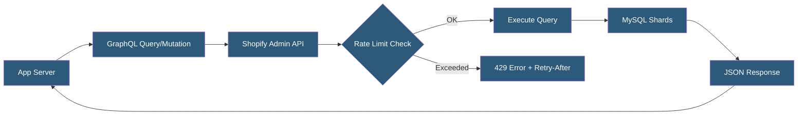

**Category:** E-commerce Hosting Platforms
**Difficulty:** Advanced
**Reading time:** 7 min read

---

The Shopify GraphQL Admin API is the primary programmatic interface for managing Shopify store data, supporting operations on products, orders, customers, inventory, fulfillment, and metafields. It replaced the legacy REST Admin API as the preferred integration method, offering typed schema introspection, batched queries, and real-time subscriptions.

- **GraphQL Schema** — A typed definition of all queryable resources and available mutations in the API surface
- **API Versioning** — Shopify releases quarterly API versions (e.g., 2024-01); apps must specify a version in the API URL
- **Rate Limits** — Query cost points system where each field and operation costs points against a per-minute bucket
- **Bulk Operations** — Asynchronous API for exporting large datasets (millions of records) without hitting rate limits
- **Mutations** — GraphQL operations that modify data (create, update, delete) as opposed to queries which only read
- **Cursor-Based Pagination** — Using opaque cursor tokens to paginate through large result sets without offset/page numbers

The Shopify GraphQL Admin API is accessed at https://{store}.myshopify.com/admin/api/{version}/graphql.json using an access token in the X-Shopify-Access-Token header. The API uses standard GraphQL POST requests with query and variables in the JSON body.

Rate limiting uses a calculated cost system: each query has a cost calculated from the number of fields requested and the connection size (how many nodes queried). Standard plans have a 50-point-per-second bucket; Plus plans have 100 points per second. Simple queries may cost 1-5 points; deeply nested queries with large connection sizes can cost 50+ points. The API returns X-GraphQL-Cost-Include header information showing actual query cost.

For data export operations that would exceed rate limits, the Bulk Operations API runs asynchronous jobs that can export millions of records. A bulk query is submitted and a webhook fires when the export is complete, providing a URL to download a JSONL file. This pattern handles inventory exports, order history downloads, and analytics data extraction.

API versioning follows a quarterly release cycle. Shopify maintains each version for one year after release, deprecating older versions with migration guides. Apps must update their API version annually to avoid using deprecated fields. The API changelog documents breaking changes between versions.

Webhooks complement the GraphQL API by pushing real-time event notifications for order creation, customer updates, inventory changes, and fulfillment events, eliminating the need for polling.

- Building custom order management dashboards pulling real-time order data
- Synchronizing Shopify product catalog with external PIM or ERP systems
- Bulk inventory updates from warehouse management systems
- Building analytics pipelines exporting order and customer data for BI tools
- Implementing fulfillment automation triggered by order status changes

| Advantage | Disadvantage |
|-----------|--------------|
| GraphQL schema introspection enables client-side type safety | Query cost system requires careful query optimization to avoid rate limit hits |
| Bulk Operations eliminates rate limit constraints for large exports | Quarterly versioning requires ongoing maintenance to avoid deprecated field errors |
| Typed schema reduces integration errors versus REST | Complexity higher than REST for simple single-resource operations |
| Real-time webhooks complement pull-based queries | Webhook delivery is not guaranteed; requires retry and deduplication logic |

- [Shopify Storefront API](shopify-storefront-api.md)
- [Shopify Webhook Events](shopify-webhook-events.md)
- [Shopify App Store Ecosystem](shopify-app-store-ecosystem.md)

---
*Part of the [E-commerce Hosting Platforms](index.md) category · [Back to Master Index](../../index.md)*
