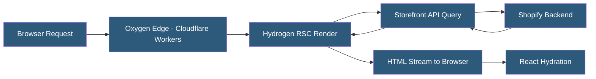

**Category:** E-commerce Hosting Platforms
**Difficulty:** Advanced
**Reading time:** 7 min read

---

Shopify Hydrogen is an official React-based framework for building custom Shopify storefronts, using the Storefront API as a data layer. It leverages React Server Components, streaming SSR, and Vite for development, and deploys to Shopify's Oxygen global edge infrastructure or any Node.js host.

- **React Server Components (RSC)** — Server-rendered React components that execute on the server, enabling data fetching without client-side JavaScript for improved performance
- **Storefront API** — Shopifys GraphQL API exposing product, cart, and customer data for headless storefronts
- **Oxygen** — Shopifys managed edge hosting for Hydrogen storefronts, built on Cloudflare Workers
- **Vite** — The development server and build tool used by Hydrogen for fast HMR and optimized production builds
- **Route-Based Code Splitting** — Hydrogen automatically splits JavaScript bundles per route to minimize initial page load
- **Remix** — The full-stack React framework underlying Hydrogen v2, providing server-side routing and nested layouts

Hydrogen v2 is built on top of Remix, providing file-based routing, server-side data loading via loader functions, and form actions for mutations. Each route file exports a loader that fetches data from the Storefront API, and a default React component that renders with that data. React Server Components allow the data-fetching component tree to execute server-side, with only interactive client components hydrated in the browser.

The Storefront API provides GraphQL access to products, collections, cart operations, customer authentication, metafields, and predictive search. Hydrogen includes typed hooks and utilities wrapping common Storefront API operations: useProduct, CartProvider, AddToCartButton, and ShopPayButton reduce boilerplate for standard e-commerce patterns.

Oxygen deployment uses Cloudflare Workers runtime — JavaScript V8 isolates running at 300+ edge locations worldwide. Each request is handled by the nearest Worker, which executes the Hydrogen render logic, calls the Storefront API from the edge, and streams HTML back to the browser. Cache-Control headers on Storefront API responses enable Oxygen to cache product data at the edge, reducing origin API calls for frequently requested content.

The developer experience uses Vite for local development with hot module replacement, TypeScript support throughout, and Shopify CLI integration for creating and deploying storefronts. Shopify's mock.shop sandbox allows development against realistic data without a real Shopify store.

- Building a custom brand storefront with unique interactions impossible in Liquid themes
- Creating a B2B headless store with custom buyer authentication and pricing
- Developing a highly optimized performance-focused storefront on Oxygen edge
- Building a multi-brand storefront aggregating products from multiple Shopify stores
- Creating content-commerce experiences combining CMS content with Shopify products

| Advantage | Disadvantage |
|-----------|--------------|
| Full React ecosystem available for custom UI components | Significantly more development complexity than Liquid themes |
| RSC and streaming SSR provide best-in-class performance | Shopify Payments and some native checkout features require additional integration |
| Oxygen edge deployment eliminates storefront hosting infrastructure | Ongoing maintenance of custom storefront vs managed Liquid theme |
| Complete design freedom not constrained by Shopify theme system | Higher developer skill requirement; Remix and RSC expertise needed |

- [Shopify Oxygen Hosting Infrastructure](shopify-oxygen-hosting-infrastructure.md)
- [Shopify Storefront API](shopify-storefront-api.md)
- [Shopify Checkout Customization](shopify-checkout-customization.md)

---
*Part of the [E-commerce Hosting Platforms](index.md) category · [Back to Master Index](../../index.md)*
