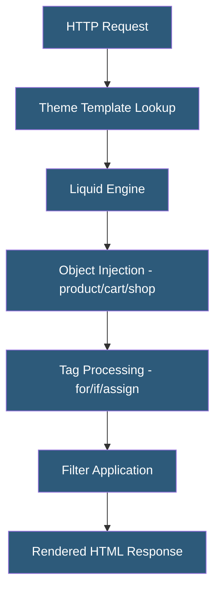

**Category:** E-commerce Hosting Platforms
**Difficulty:** Intermediate
**Reading time:** 6 min read

---

Liquid is Shopify's open-source templating language used to build Shopify theme files, combining HTML with dynamic data from the store. Originally created by Shopify in 2006, Liquid is now used across multiple platforms and provides a safe, sandboxed way for merchants to customize storefronts without executing arbitrary server code.

- **Object** — A Liquid data container (e.g., product, cart, customer) providing access to store data within templates
- **Tag** — Liquid control flow constructs (if, for, unless, case) and output tags (assign, capture, increment)
- **Filter** — Functions applied to Liquid variables to transform output (e.g., upcase, money, date, truncate)
- **Section** — A modular, configurable theme component that merchants can add, remove, and reorder via the theme editor
- **Snippet** — A reusable partial template included in other templates via the render tag
- **Schema** — JSON configuration within section files defining customizable settings available in the theme editor

Liquid templates are text files with .liquid extensions that combine static HTML with dynamic Liquid markup. Shopify's servers process Liquid templates at request time, injecting store data into the template context before rendering. The Liquid engine executes tags and resolves object properties, producing clean HTML output sent to the browser.

The template hierarchy in Shopify themes follows a layout > template > section > snippet structure. Layout files (theme.liquid) wrap all pages with a consistent header/footer. Template files (product.liquid, collection.liquid) handle specific page types. Sections are modular components with their own Liquid, CSS, and JavaScript, configurable via a JSON schema that defines settings exposed in the theme editor. Merchants drag-and-drop sections to customize page layout without code changes.

Liquid's sandboxed design is intentional security architecture. Templates cannot access the file system, make HTTP requests, or execute arbitrary Ruby/JavaScript code. This sandbox makes it safe for Shopify to execute merchant-provided Liquid templates on shared infrastructure without isolation risk.

The Online Store 2.0 update introduced JSON templates (replacing .liquid templates with .json files pointing to sections) and enhanced section groups, enabling more granular merchant customization. Theme blocks allow nesting configurable components within sections, creating a flexible drag-and-drop page building experience while maintaining Liquid's rendering model.

- Building custom product pages with dynamic data binding
- Creating configurable sections for merchant theme customization
- Implementing conditional display logic based on product tags or metafields
- Rendering cart and checkout elements with customer-specific data
- Building multi-language storefronts using Liquid translation filters

| Advantage | Disadvantage |
|-----------|--------------|
| Sandboxed execution is safe for multi-tenant theme rendering | Limited compared to full programming languages; no external HTTP calls |
| Merchant-configurable sections enable customization without code | Template rendering is synchronous; complex pages may be slow to render |
| Large community of Liquid developers and theme resources | Logic-heavy templates become difficult to maintain at scale |
| Online Store 2.0 enables rich drag-and-drop customization | Liquid is Shopify-specific; skills do not transfer to other platforms |

- [Shopify Theme Development](shopify-theme-development.md)
- [Shopify Platform Architecture](shopify-platform-architecture.md)
- [Shopify Hydrogen Headless Framework](shopify-hydrogen-headless-framework.md)

---
*Part of the [E-commerce Hosting Platforms](index.md) category · [Back to Master Index](../../index.md)*
