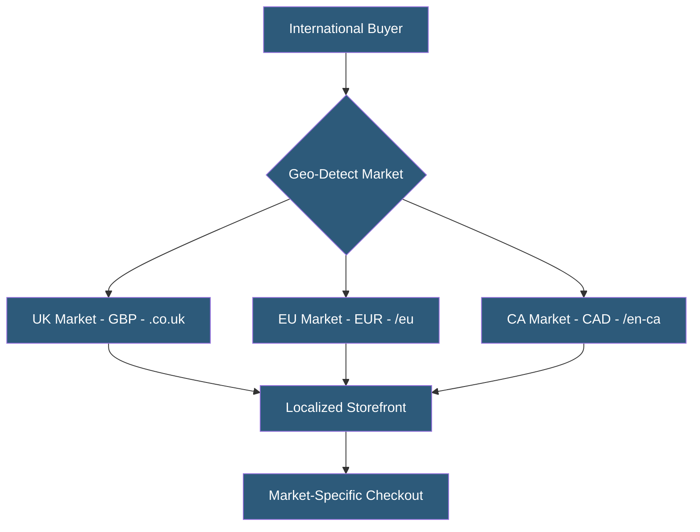

**Category:** E-commerce Hosting Platforms
**Difficulty:** Intermediate
**Reading time:** 6 min read

---

Shopify Markets is a cross-border commerce management feature enabling merchants to sell internationally from a single Shopify store, supporting localized pricing, currencies, languages, domains, and duty calculation. It replaces the previous approach of creating separate stores per country.

- **Market** — A geographic selling context (country or region group) with specific pricing, currency, language, and domain settings
- **Currency Conversion** — Automatic display of prices in local currencies using exchange rates; settlement occurs in the merchant base currency
- **Localized Domains** — Country-specific domains or subdomains (e.g., store.co.uk, store.com/en-ca) routing buyers to localized storefronts
- **Duty and Import Tax** — Calculation and collection of customs duties at checkout to prevent unexpected charges on delivery
- **International Pricing** — Custom price adjustments per market enabling price localization beyond simple currency conversion
- **Market-Specific Payment Methods** — Configuring locally preferred payment options (iDEAL in Netherlands, Klarna in Germany) per market

Shopify Markets creates market configurations within a single store rather than requiring separate stores for each country. Each market defines the countries it covers, the display currency, the URL structure (subdirectory /en-gb or subdomain store.co.uk), and any market-specific customizations.

Buyers are automatically routed to their market based on browser locale, IP geolocation, or explicit selection. The storefront displays prices in local currency (converted from base currency using exchange rates updated twice daily) and shows content in the configured language if translations are installed. Markets can have unique theme content by leveraging metafields to store market-specific copy.

International pricing allows merchants to set explicit market prices rather than relying solely on currency conversion. A product priced at $100 USD might be priced at £90 GBP (not the £79 auto-converted rate) to account for local market expectations, VAT inclusion, or competitive positioning. Percentage adjustments can apply uniformly to all products in a market.

Duty and import tax calculation uses Shopify's integration with cross-border duty databases to estimate import charges at checkout. Collecting duties upfront (DDP — Delivered Duty Paid) improves buyer experience by preventing customs surprises on delivery. This requires merchants to file for importer of record arrangements in target markets.

- DTC brand expanding from US-only to global markets
- Fashion retailer requiring localized pricing in EU, UK, Canada, and Australia
- Merchants needing VAT-inclusive pricing for EU compliance
- Brands offering country-specific product catalogs (different SKUs per region)
- E-commerce businesses wanting a single Shopify admin for multi-country operations

| Advantage | Disadvantage |
|-----------|--------------|
| Single store simplifies admin and inventory management | Currency conversion relies on Shopify exchange rates which may lag spot rates |
| Native duty calculation improves international buyer experience | Market-specific features require Plus plan for full customization |
| No additional per-store fees for international expansion | Complex tax compliance (VAT OSS, GST) still requires third-party apps |
| Automatic buyer routing reduces friction in market selection | Content localization requires separate translation management |

- [Shopify Platform Architecture](shopify-platform-architecture.md)
- [Shopify Payments Processing](shopify-payments-processing.md)
- [Shopify Checkout Customization](shopify-checkout-customization.md)

---
*Part of the [E-commerce Hosting Platforms](index.md) category · [Back to Master Index](../../index.md)*
