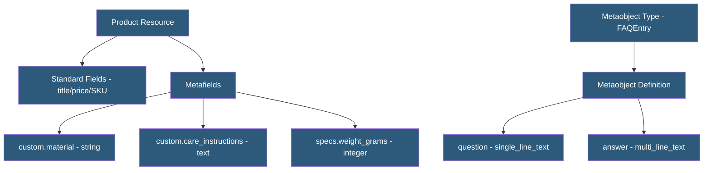

**Category:** E-commerce Hosting Platforms
**Difficulty:** Intermediate
**Reading time:** 6 min read

---

Shopify metafields extend standard resource fields with custom data (sizing guides, care instructions, technical specs) that can be displayed in themes and accessed via API. Metaobjects provide a structured CMS-like content type system for creating custom data structures like staff profiles, FAQs, or lookbooks.

- **Metafield** — A custom key-value data field attached to a Shopify resource (product, variant, order, customer, collection)
- **Metafield Namespace** — A prefix grouping related metafields to prevent naming conflicts between apps (e.g., custom.sizing_guide)
- **Metafield Type** — The data type of the metafield value: single_line_text, multi_line_text, integer, json, file_reference, product_reference, etc.
- **Metaobject** — A custom content type definition creating structured, repeatable data entries stored and managed in Shopify
- **Storefront Visibility** — Metafields can be configured as accessible via the Storefront API for use in headless storefronts
- **Definition** — A declared metafield schema with type, validation rules, and namespace/key that enables admin editing UI

Metafields extend Shopify's standard resource schema with custom data without requiring app development. Merchants define metafields through the Shopify Admin's custom data section, specifying namespace, key, type, and validation constraints. Once defined, metafields appear as editable fields on the resource edit page, enabling content teams to enter custom data without developer involvement.

Metafield types cover a wide range: text types (single-line, multi-line, rich text HTML), numeric types (integer, decimal, money), references (file_reference links to uploaded files, product_reference, variant_reference), and JSON for arbitrary structured data. File references are particularly useful for attaching size guides or technical specification PDFs to products.

In Liquid themes, metafields are accessed via the resource object: product.metafields.custom.care_instructions renders the value in the template. In Hydrogen headless storefronts, metafields are queried directly in GraphQL by adding the metafield query to the product query, specifying the namespace and key.

Metaobjects provide a structured content model: a metaobject type definition (like "FAQEntry" or "TeamMember") declares fields with types and validation. Content editors create entries (instances) of the type in the Shopify admin, similar to a headless CMS. Metaobject entries are queryable via the Storefront API for rendering custom content sections in themes and headless storefronts.

- Storing product-specific attributes not covered by standard Shopify fields
- Creating a FAQ or team page using metaobjects as a lightweight headless CMS
- Attaching size guides, care instructions, and technical specs to products
- Building custom product badges based on metafield values in themes
- Syncing external PIM data to Shopify via metafield API updates

| Advantage | Disadvantage |
|-----------|--------------|
| Extends Shopify data model without custom app development | Complex JSON metafields lack structured editing UI in admin |
| Native admin editing enables content team self-service | Storefront API access for metafields requires explicit visibility configuration |
| Metaobjects provide CMS-like content modeling within Shopify | Metaobjects lack advanced CMS features (localization, scheduling, versioning) |
| Type system prevents invalid data entry via validation | Metafield data is tightly coupled to Shopify; complex to migrate externally |

- [Shopify GraphQL Admin API](shopify-graphql-admin-api.md)
- [Shopify Liquid Templating Engine](shopify-liquid-templating-engine.md)
- [Shopify Storefront API](shopify-storefront-api.md)

---
*Part of the [E-commerce Hosting Platforms](index.md) category · [Back to Master Index](../../index.md)*
