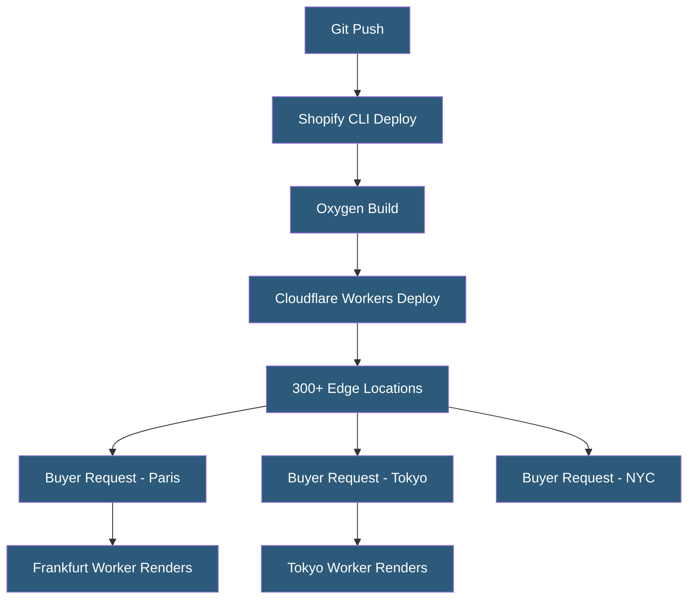

**Category:** E-commerce Hosting Platforms
**Difficulty:** Advanced
**Reading time:** 6 min read

---

Shopify Oxygen is a globally distributed hosting platform for Hydrogen storefronts built on Cloudflare Workers, providing edge rendering with sub-50ms TTFB worldwide. Included free with Shopify plans that support Hydrogen, it eliminates the need to provision and manage separate serverless or CDN infrastructure for headless storefronts.

- **Cloudflare Workers Runtime** — V8 JavaScript isolates running at 300+ Cloudflare edge locations providing ultra-low-latency compute globally
- **Edge Rendering** — Executing Hydrogen server-side rendering at the CDN edge nearest to the buyer, minimizing network round trips
- **Deployment Environments** — Oxygen supports multiple named environments (production, preview, custom) for branch-based deployments
- **Custom Domains** — Configuring merchant-owned domains to point to Oxygen-hosted storefronts
- **Environment Variables** — Secure storage for Storefront API tokens and other secrets accessible to Oxygen Workers
- **Preview Deployments** — Automatic unique URL deployments for every Git branch enabling PR review of storefront changes

Oxygen accepts Hydrogen application bundles built with Shopify CLI. The CLI packages the Remix/Hydrogen application into a Cloudflare Workers compatible format and uploads it to Oxygen via Shopify's deployment API. Oxygen distributes the Worker code to Cloudflare's global network, making it available at every edge location within seconds.

The Worker runtime handles HTTP requests at the edge: it imports the Hydrogen application bundle, executes the appropriate route handler, calls the Shopify Storefront API over a fast direct connection, streams the React server-rendered HTML to the browser, and sends cache-control headers to instruct downstream caching layers.

Caching in Oxygen operates at two levels. Response caching stores rendered HTML and API responses at the edge, serving subsequent requests without re-executing the Worker until the cache entry expires. Request deduplication collapses multiple simultaneous identical requests to a single Storefront API call during the cache population phase.

Environment management supports multiple deployment channels. Each Oxygen deployment has a production environment serving the primary custom domain, and optionally staging and development environments on Shopify-provided subdomains. Preview deployments deploy automatically when PRs are opened against the connected GitHub repository, creating unique URLs for QA review before merging to production.

- Deploying Hydrogen storefronts with global edge performance without infrastructure setup
- Branch-based preview deployments for storefront QA workflows
- Running A/B tests with environment-specific configurations
- Serving global buyers with consistent sub-50ms TTFB regardless of location
- Zero-DevOps headless storefront hosting included in Shopify plan cost

| Advantage | Disadvantage |
|-----------|--------------|
| Free hosting included in eligible Shopify plans reduces TCO | Limited to Hydrogen/Remix framework; other Node.js apps cannot use Oxygen |
| Cloudflare Workers provides class-leading edge compute performance | Cloudflare Workers runtime limitations apply (no file system, limited CPU time) |
| Preview deployments streamline headless storefront review workflows | Less configurability than self-managed Cloudflare Workers deployment |
| Global distribution without managing CDN or server infrastructure | Debugging edge-rendered issues requires specific tooling and observability |

- [Shopify Hydrogen Headless Framework](shopify-hydrogen-headless-framework.md)
- [Shopify Storefront API](shopify-storefront-api.md)
- [Shopify CLI Development Tools](shopify-cli-development-tools.md)

---
*Part of the [E-commerce Hosting Platforms](index.md) category · [Back to Master Index](../../index.md)*
