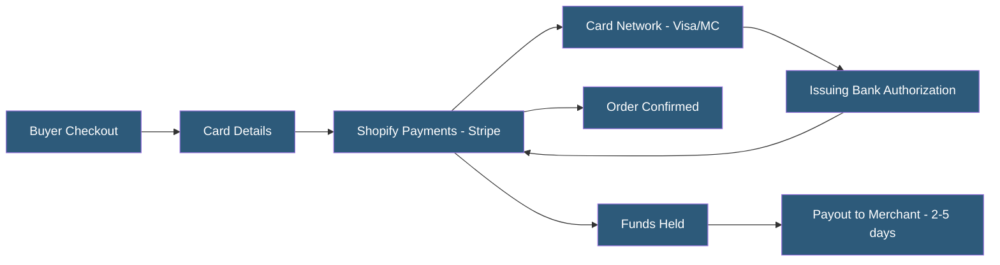

**Category:** E-commerce Hosting Platforms
**Difficulty:** Intermediate
**Reading time:** 6 min read

---

Shopify Payments is Shopify's integrated payment processor powered by Stripe, eliminating the need for third-party payment gateways and transaction fees for merchants who use it. It supports credit cards, Shop Pay, Apple Pay, Google Pay, and buy-now-pay-later options across supported countries.

- **Transaction Fee Waiver** — Merchants using Shopify Payments pay no additional transaction fee beyond card processing rates; third-party gateways incur 0.5-2% additional fees
- **Shop Pay** — Shopifys accelerated checkout storing buyer information for one-click checkout across all Shopify stores
- **Chargeback Management** — Integrated tools for responding to payment disputes directly from the Shopify admin
- **Payout Schedule** — The cadence at which Shopify Payments deposits funds to merchant bank accounts (2-5 business days standard)
- **Card Testing Fraud** — Fraudulent use of merchant checkout to validate stolen card numbers; Shopify Payments fraud analysis detects this pattern
- **Shopify Balance** — A merchant banking product providing a Shopify-issued business account and debit card funded by Shopify Payments payouts

Shopify Payments integrates Stripe's payment infrastructure directly into the Shopify checkout. Merchants activate it from the Payments settings and complete identity verification (KYC) by providing business information and banking details. No separate payment processor contract or gateway integration is required.

Processing rates vary by Shopify plan tier: Basic (2.9% + 30c), Shopify (2.6% + 30c), Advanced (2.4% + 30c), and Plus (custom negotiated rates). These rates apply to online card transactions; in-person rates are lower for card-present transactions. Premium plans also reduce the additional transaction fee charged when third-party gateways are used.

Shop Pay is Shopify's network-wide accelerated checkout. Buyers who have purchased from any Shopify store can check out on new stores by entering their phone number or email, receiving an OTP, and confirming stored shipping and payment details. Shop Pay converts buyers at rates 1.72x higher than standard checkout according to Shopify's data, due to reduced form-filling friction.

Fraud analysis runs automatically on every transaction, evaluating indicators like billing/shipping address mismatch, IP geolocation, known fraud patterns, and order velocity. High-risk orders are flagged for manual review. Shopify also provides chargeback protection for eligible orders that pass fraud analysis — Shopify covers the dispute cost if the buyer claims they never received the item.

- Merchants seeking simplified payment setup without separate gateway contracts
- Stores wanting to offer Shop Pay for conversion rate improvements
- International merchants needing multi-currency checkout
- B2C brands wanting buy-now-pay-later through Shopify Installments (Shop Pay Installments)
- Merchants wanting integrated chargeback management within Shopify admin

| Advantage | Disadvantage |
|-----------|--------------|
| Eliminates third-party transaction fees, reducing total processing cost | Not available in all countries; restricted product categories may be blocked |
| Shop Pay network improves repeat buyer conversion | Payout holds during chargeback disputes can affect cash flow |
| Integrated fraud analysis reduces manual review burden | Merchants have limited visibility into Stripe underwriting decisions |
| Chargeback protection reduces dispute loss for eligible orders | Requires identity verification which can delay merchant activation |

- [Shopify Platform Architecture](shopify-platform-architecture.md)
- [Shopify Checkout Customization](shopify-checkout-customization.md)
- [Shopify Markets for International Selling](shopify-markets-for-international-selling.md)

---
*Part of the [E-commerce Hosting Platforms](index.md) category · [Back to Master Index](../../index.md)*
