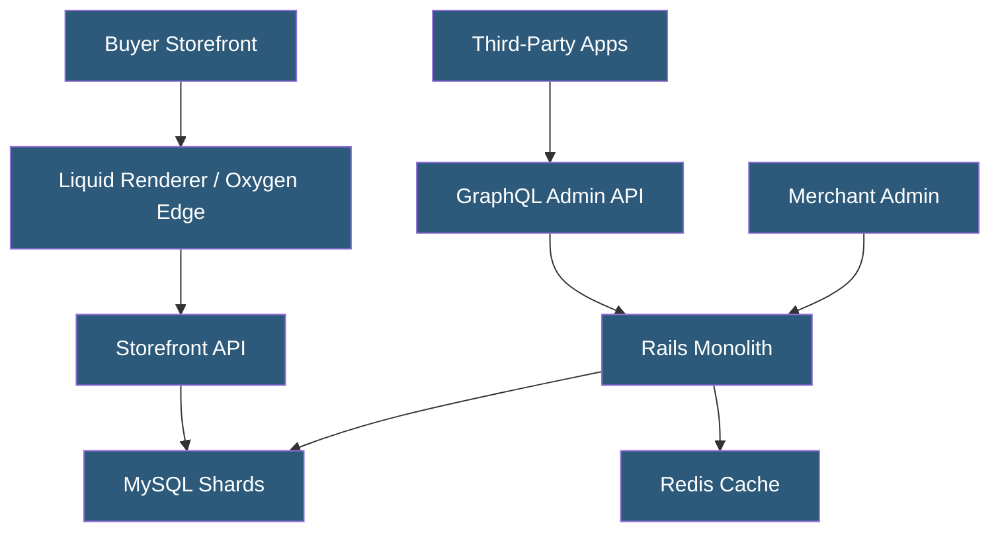

**Category:** E-commerce Hosting Platforms
**Difficulty:** Intermediate
**Reading time:** 6 min read

---

Shopify is a multi-tenant SaaS e-commerce platform built on a Ruby on Rails monolith that has evolved to include microservices, edge computing via Oxygen, and a Kubernetes-based infrastructure serving over 4 million merchants. Its architecture prioritizes developer productivity, horizontal scalability, and resilience under extreme traffic peaks like Black Friday.

- **Multi-Tenancy** — All Shopify merchants share infrastructure while remaining logically isolated through shop-ID-based data partitioning
- **Storefront Rendering** — The process of generating HTML pages for buyer-facing storefronts, traditionally server-side with Liquid templates
- **Shop Namespace** — The data isolation boundary for each merchant; database sharding routes each shop to a specific shard
- **Shopify Balance** — Shopifys internal workload scheduling system that manages job queues and background task execution
- **Edge Commerce** — Shopifys strategy of moving storefront rendering to CDN edge nodes for lowest possible latency via Oxygen
- **GraphQL API Surface** — The primary developer integration layer exposing Admin and Storefront APIs as typed GraphQL schemas

Shopify began as a Ruby on Rails application in 2004 and has scaled it to handle millions of merchants through database sharding (each shop is assigned to one of hundreds of MySQL shards), extensive caching with Redis and Memcached, and a microservices extraction strategy for compute-intensive subsystems.

The platform uses a modular monolith internally branded as "the monolith" at Shopify — a Rails application with strict module boundaries enforced by tooling. New features are built as modules within this boundary or as separate services. Payments, shipping, and checkout operate as separate services communicating via internal APIs and event buses.

Shopify's storefront serving traditionally used Liquid template rendering on application servers, with Fastly CDN caching rendered HTML. The introduction of Oxygen (2022+) moved Hydrogen React storefronts to Cloudflare Workers at the edge, enabling React Server Components rendering geographically close to buyers and eliminating origin round-trips.

Black Friday/Cyber Monday (BFCM) requires extreme scale — Shopify has managed peaks exceeding 6 million requests per minute. The platform relies on pre-warming, capacity over-provisioning, graceful degradation (shedding non-critical work), and a global flash sale queuing system to manage sudden traffic spikes without impacting checkout reliability.

- Launching a DTC (direct-to-consumer) brand needing integrated payments and fulfillment
- Building a custom storefront using Shopify as a commerce backend
- Scaling from startup to enterprise within a single platform
- Integrating third-party apps (email, reviews, loyalty) via the App Store
- Building a custom checkout experience using Checkout Extensions

| Advantage | Disadvantage |
|-----------|--------------|
| Fully managed infrastructure eliminates DevOps for merchants | Customization constrained by platform sandbox and app model |
| Proven scalability for extreme traffic events | Monthly subscription plus transaction fees increase total cost of ownership |
| Large app ecosystem reduces custom development needs | Full data ownership limited; data lives in Shopify infrastructure |
| Constant platform investment by Shopify engineering | Deep platform dependency creates switching costs |

- [Shopify Liquid Templating Engine](shopify-liquid-templating-engine.md)
- [Shopify Hydrogen Headless Framework](shopify-hydrogen-headless-framework.md)
- [Shopify GraphQL Admin API](shopify-graphql-admin-api.md)

---
*Part of the [E-commerce Hosting Platforms](index.md) category · [Back to Master Index](../../index.md)*
