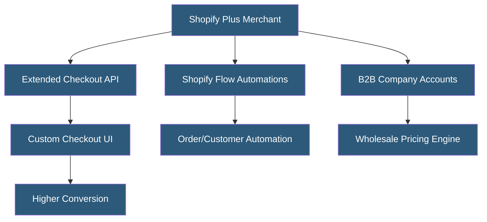

**Category:** E-commerce Hosting Platforms
**Difficulty:** Advanced
**Reading time:** 6 min read

---

Shopify Plus is Shopify's enterprise tier targeting merchants with high sales volume, offering higher API rate limits, dedicated support, advanced customization capabilities, and infrastructure built for extreme traffic. It starts at $2,000/month and includes features unavailable on standard Shopify plans.

- **Checkout Extensibility** — Shopify Plus exclusive APIs for customizing checkout UI with branded elements, custom fields, and conditional logic
- **Shopify Flow** — Visual workflow automation exclusive to Plus, enabling complex order routing, fraud rules, and customer segmentation
- **B2B Commerce** — Native wholesale functionality in Shopify Plus including company accounts, custom pricing, and purchase orders
- **Exclusive API Rate Limits** — Plus stores receive higher GraphQL bucket sizes (100,000+ points vs 50,000 for standard plans)
- **Merchant Success Manager** — Dedicated account manager providing strategic guidance and priority support
- **Launchpad** — A Plus-exclusive tool for scheduling automated sale launches, price changes, and theme deployments

Shopify Plus operates on the same underlying infrastructure as standard Shopify but unlocks additional platform capabilities and removes limitations that would constrain enterprise operations. The platform guarantees 99.99% uptime SLA with infrastructure pre-scaled for high-volume events.

Checkout extensibility is the flagship Plus feature. Standard Shopify merchants cannot modify the checkout flow beyond basic customization; Plus merchants access Checkout UI Extensions for adding custom fields, loyalty point displays, gift message inputs, and branded elements. Checkout Functions enable serverless customizations to discount logic, payment methods, and shipping options, executing in Shopify's infrastructure without external server dependencies.

The B2B features native to Plus (introduced 2022-2023) replace the previous requirement for third-party wholesale apps. Plus merchants create company accounts with multiple locations, assign custom price lists per company, require purchase orders, and set credit limits — all within the native Shopify admin.

Shopify Flow provides a visual workflow builder for automating repetitive tasks: auto-tagging orders above a dollar threshold, sending alerts for high-risk orders, creating customer segments after purchase, or triggering fulfillment workflows. Flows connect Shopify events to actions within Shopify and third-party apps that have Flow integrations.

- High-volume DTC brands needing customized checkout for conversion optimization
- Wholesale/B2B businesses requiring native company account management
- Brands launching flash sales needing Launchpad for automated event execution
- Enterprise merchants requiring higher API throughput for integrations
- International brands needing multi-storefront management under one Plus account

| Advantage | Disadvantage |
|-----------|--------------|
| Checkout extensibility enables conversion optimization unavailable below Plus | $2,000+/month starting cost requires significant revenue to justify |
| Native B2B eliminates third-party wholesale app dependency | Some enterprise features still require custom apps vs native solutions |
| Higher API limits support complex integration architectures | Still constrained by Shopify platform; cannot access raw infrastructure |
| Dedicated support reduces issue resolution time | Lock-in deepens at Plus tier due to custom checkout investment |

- [Shopify Platform Architecture](shopify-platform-architecture.md)
- [Shopify Functions Serverless](shopify-functions-serverless.md)
- [Shopify Flow Automation](shopify-flow-automation.md)

---
*Part of the [E-commerce Hosting Platforms](index.md) category · [Back to Master Index](../../index.md)*
