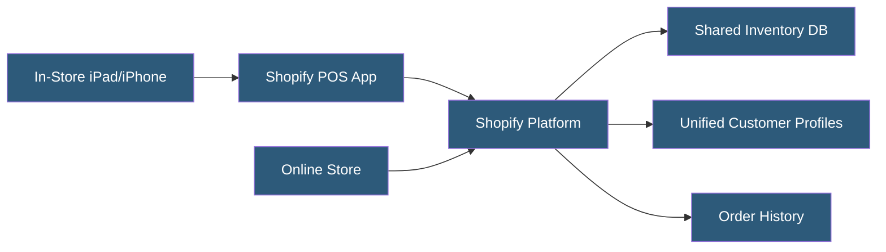

**Category:** E-commerce Hosting Platforms
**Difficulty:** Intermediate
**Reading time:** 5 min read

---

Shopify POS is an integrated point-of-sale system connecting physical retail operations to the Shopify e-commerce platform. It unifies inventory, customer data, and order history across online and in-store channels, enabling merchants to manage their entire retail business from a single platform.

- **Unified Commerce** — The integration of online and in-store selling on a single platform with shared inventory and customer records
- **Shopify POS Pro** — The advanced POS tier with staff permissions, advanced reporting, unlimited registers, and in-store analytics
- **Tap to Pay** — Contactless payment acceptance on iPhone without additional hardware using NFC
- **POS Terminal** — Shopifys dedicated card reader hardware (POS Go, Tap & Chip Reader) integrated with the POS app
- **Location Inventory** — Stock tracking across multiple retail locations with location-specific availability
- **Omnichannel Fulfillment** — The ability to fulfill online orders from in-store inventory (buy online, pick up in store; ship from store)

Shopify POS runs as an iOS application on iPad or iPhone devices. The app connects to the merchant's Shopify store over internet, accessing real-time inventory levels, product catalog, customer profiles, and discount codes. Sales staff create carts, scan barcodes with the device camera, apply discounts, and process payments.

Payment processing integrates Shopify Payments hardware: the Tap & Chip reader connects via Bluetooth for card-present transactions, while Tap to Pay on iPhone enables contactless NFC payments without additional hardware in supported markets. Third-party payment terminals (for merchants not using Shopify Payments) connect via the POS terminal integration.

Inventory synchronization is real-time across channels. When a sale is completed in the POS, inventory decrements immediately in the central platform, updating online store availability. This prevents overselling across channels. Location-based inventory lets merchants assign stock to specific store locations and route online orders to the nearest location with available stock.

Staff permissions control what actions employees can perform: applying discounts above certain thresholds, processing refunds, and accessing reports can each be gated to manager-level accounts. Staff PINs log activity per employee for accountability. The POS Pro tier removes limits on staff accounts and registers, which is otherwise capped at unlimited for Plus or limited on lower plans.

- Brick-and-mortar retailers selling both in-store and online needing unified inventory
- Pop-up shops and markets accepting card payments via mobile POS
- Retailers implementing buy-online-pick-up-in-store fulfillment
- Franchise operations with multiple retail locations under one Shopify account
- Showrooms accepting in-person payments for online catalog products

| Advantage | Disadvantage |
|-----------|--------------|
| Unified inventory eliminates multi-system synchronization complexity | Requires internet connectivity; offline mode has limited functionality |
| Single platform for online and in-store simplifies operations | Shopify Payments required for card-present processing in most markets |
| Real-time inventory prevents overselling across channels | Hardware costs for Tap & Chip readers add upfront investment |
| Customer profiles include full purchase history across channels | POS Pro add-on cost increases monthly platform fees |

- [Shopify Platform Architecture](shopify-platform-architecture.md)
- [Shopify Payments Processing](shopify-payments-processing.md)
- [Shopify Markets for International Selling](shopify-markets-for-international-selling.md)

---
*Part of the [E-commerce Hosting Platforms](index.md) category · [Back to Master Index](../../index.md)*
