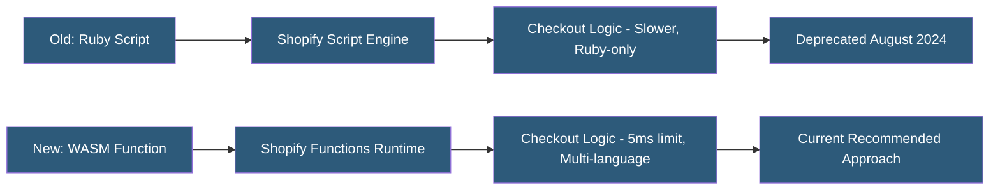

**Category:** E-commerce Hosting Platforms
**Difficulty:** Intermediate
**Reading time:** 5 min read

---

Shopify Scripts was a Ruby-based server-side scripting feature for Shopify Plus that enabled custom discount, shipping, and payment logic at checkout. It was deprecated in 2024 in favor of Shopify Functions, which uses a WebAssembly-based model with better performance, more programming language support, and enhanced functionality.

- **Line Item Script** — A deprecated Shopify Script type modifying cart items, prices, and properties during checkout
- **Shipping Script** — A deprecated script type filtering and modifying available shipping options
- **Payment Script** — A deprecated script type filtering payment method availability
- **Shopify Scripts Editor** — The now-deprecated web-based Ruby IDE for writing and testing scripts
- **Script Migration** — The process of converting Ruby-based Scripts to equivalent Shopify Functions in supported languages
- **Deprecation Timeline** — Scripts were deprecated August 2024 with mandatory migration to Functions

Shopify Scripts were Ruby scripts that executed at checkout time to calculate dynamic discounts, filter shipping methods, or hide/show payment options based on cart contents, customer data, or metafield values. Scripts were uploaded via the Script Editor app in the Shopify admin and executed within Shopify's Ruby sandbox.

The Ruby execution model had limitations: Scripts had limited access to external data (no HTTP calls), Ruby knowledge was required, and execution time constraints were less strict than Functions. The Script Editor provided a simplified web IDE with test data but limited debugging capabilities.

Shopify Functions replaces Scripts with a WebAssembly execution model. Functions are compiled to WASM from Rust, JavaScript/TypeScript, or AssemblyScript and must complete within 5 milliseconds. The tighter performance constraint reflects Shopify's commitment to sub-100ms checkout rendering. Functions also have access to metafields on cart lines and products, providing richer data for conditional logic.

Migration from Scripts to Functions is not a simple translation — the Ruby logic must be reimplemented in a Functions-compatible language. Shopify provided migration guides for common Script patterns and the Shopify CLI generates Function boilerplate with example implementations of the most common use cases.

- Understanding the historical context of Shopify checkout customization evolution
- Migrating legacy Script logic to Shopify Functions before deprecation deadline
- Debugging integration issues in stores that used Scripts prior to migration
- Planning checkout customization architecture for new Plus implementations
- Evaluating Functions as the replacement for discount logic in existing stores

| Advantage (Scripts was) | Disadvantage (Scripts was) |
|-----------|--------------|
| Ruby was familiar for developers with Shopify background | Ruby-only language constraint limited developer pool |
| No compilation step simplified development iteration | Performance less constrained than Functions 5ms limit |
| Web-based editor allowed quick inline editing | Limited data access compared to Functions |
| Simpler model for straightforward discount logic | Deprecated; continued use after August 2024 was not supported |

- [Shopify Functions Serverless](shopify-functions-serverless.md)
- [Shopify Plus Enterprise Features](shopify-plus-enterprise-features.md)
- [Shopify Checkout Customization](shopify-checkout-customization.md)

---
*Part of the [E-commerce Hosting Platforms](index.md) category · [Back to Master Index](../../index.md)*
