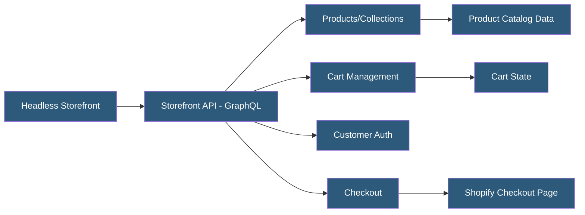

**Category:** E-commerce Hosting Platforms
**Difficulty:** Advanced
**Reading time:** 6 min read

---

The Shopify Storefront API is a public-facing GraphQL API providing buyer-centric access to product catalogs, cart management, customer authentication, and checkout initiation for headless storefronts. Unlike the Admin API, it uses a storefront access token and is designed for client-side and edge execution.

- **Storefront Access Token** — A public-safe token (unlike Admin API tokens) used to authenticate requests to the Storefront API from client-side code
- **Cart API** — GraphQL operations for creating and managing shopping carts without requiring buyer authentication
- **Customer Access Token** — A short-lived token issued after buyer login enabling access to order history and saved addresses
- **Product Availability** — Real-time inventory data for products and variants exposed through the API
- **Predictive Search** — An API endpoint for autocomplete search results with low latency and configurable resource types
- **Internationalization** — Language and market context parameters enabling localized price and content responses

The Storefront API is accessed at https://{store}.myshopify.com/api/{version}/graphql.json using a public storefront access token in the X-Shopify-Storefront-Access-Token header. Because the token is public-safe (it only provides read access to published data and cart write access), it can be embedded in client-side JavaScript or edge Worker code without security risk.

Product queries return published products with their variants, images, metafields, and pricing. The API respects publication channels — products not published to the Online Store channel are not returned. Availability data includes inventory quantities by location when enabled, supporting real-time in-stock status display.

Cart management is stateful: merchants create a cart via cartCreate mutation, receiving a cart ID and checkout URL. The cart ID is persisted in local storage or cookies and used for subsequent cartLinesAdd, cartLinesUpdate, and cartLinesRemove mutations. When checkout is initiated, the buyer is directed to the Shopify-hosted checkout URL derived from the cart ID, where Shopify handles payment processing in its PCI-compliant environment.

Customer operations (login, registration, order history) use a separate customer account flow. The customerAccessTokenCreate mutation exchanges credentials for a short-lived token used in customer queries. Shopify's newer Customer Account API uses OAuth 2.0 for a more secure, session-based customer authentication flow suitable for headless implementations.

Rate limiting is more permissive than the Admin API: the Storefront API is designed for high-traffic buyer-facing usage with rate limits scaled for storefront traffic patterns.

- Powering product pages in Hydrogen headless storefronts
- Building mobile commerce apps using Shopify as the commerce backend
- Implementing site search and autocomplete with Predictive Search API
- Creating custom cart experiences with extended cart attributes
- Fetching localized product data for international storefronts

| Advantage | Disadvantage |
|-----------|--------------|
| Public-safe token enables client-side usage without exposing admin credentials | Read-only for catalog data; mutations limited to cart operations |
| High rate limits support production storefront traffic | Checkout remains Shopify-hosted; full custom checkout requires headless checkout workarounds |
| Customer account integration supports buyer authentication flows | Customer Account API (OAuth) adds complexity versus simple credential exchange |
| Internationalization context enables localized catalog responses | Some Admin-only data (cost prices, private notes) not accessible via Storefront API |

- [Shopify GraphQL Admin API](shopify-graphql-admin-api.md)
- [Shopify Hydrogen Headless Framework](shopify-hydrogen-headless-framework.md)
- [Shopify Webhook Events](shopify-webhook-events.md)

---
*Part of the [E-commerce Hosting Platforms](index.md) category · [Back to Master Index](../../index.md)*
