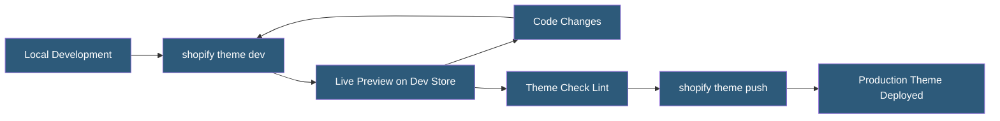

**Category:** E-commerce Hosting Platforms
**Difficulty:** Intermediate
**Reading time:** 6 min read

---

Shopify theme development involves creating and customizing the visual presentation layer of Shopify storefronts using Liquid templates, CSS, JavaScript, and JSON configuration. Themes define the entire buyer experience from product pages to checkout, and the Shopify CLI provides a local development workflow with live preview.

- **Dawn Theme** — Shopifys official reference theme built with Online Store 2.0 architecture, serving as the recommended starting point
- **Shopify CLI** — Command-line tool for theme development, enabling local preview, theme deployment, and developer workflow automation
- **Theme Editor** — The drag-and-drop customization interface merchants use to configure sections, blocks, and settings without code
- **Development Store** — A free test store used by theme developers for building and testing without live traffic
- **Theme Check** — A linting tool validating Liquid, JSON, and CSS in themes against Shopify best practices
- **GitHub Integration** — Connecting a theme to a GitHub repository for version-controlled deployment and collaboration

Shopify themes consist of a directory structure with standardized folders: layout/ (base templates), templates/ (page-type templates), sections/ (modular components), snippets/ (reusable partials), assets/ (CSS, JavaScript, images), config/ (settings schema), and locales/ (translation strings).

The Shopify CLI enables local development by establishing a bi-directional sync between local files and a development store. Running `shopify theme dev` opens a preview URL on the development store that reflects local file changes in near real-time. Developers edit files locally in their IDE while previewing the result in a real Shopify environment with actual store data.

Section schema JSON defines customizable settings exposed in the Theme Editor. A section can have color pickers, text inputs, image selectors, and rich text editors that merchants configure without code. Settings are accessed in Liquid via section.settings.setting_name. This architecture separates developer-built structure from merchant-controlled content.

Shopify enforces performance constraints on themes: JavaScript bundles above certain sizes trigger warnings, render-blocking scripts are discouraged, and Theme Check validates against 50+ Liquid and HTML best practices. The Shopify Speed Score measures storefront loading performance and is publicly visible, creating market pressure for theme developers to optimize.

- Building a custom brand storefront from scratch using Dawn as a base
- Creating a commercial theme for sale on the Shopify Theme Store
- Extending an existing theme with custom sections for specific functionality
- Migrating a custom theme to Online Store 2.0 architecture
- Building a client merchant storefront with specific design requirements

| Advantage | Disadvantage |
|-----------|--------------|
| Managed hosting means no server maintenance for theme developers | Liquid sandbox limits dynamic functionality compared to custom storefronts |
| Theme Editor gives merchants control without developer involvement | Complex interactions require JavaScript workarounds for Liquid limitations |
| Dawn reference theme provides solid, performant starting point | Theme store approval process adds time-to-market for commercial themes |
| Shopify CLI provides productive local development workflow | Breaking changes in Shopify platform can require theme updates |

- [Shopify Liquid Templating Engine](shopify-liquid-templating-engine.md)
- [Shopify CLI Development Tools](shopify-cli-development-tools.md)
- [Shopify Hydrogen Headless Framework](shopify-hydrogen-headless-framework.md)

---
*Part of the [E-commerce Hosting Platforms](index.md) category · [Back to Master Index](../../index.md)*
